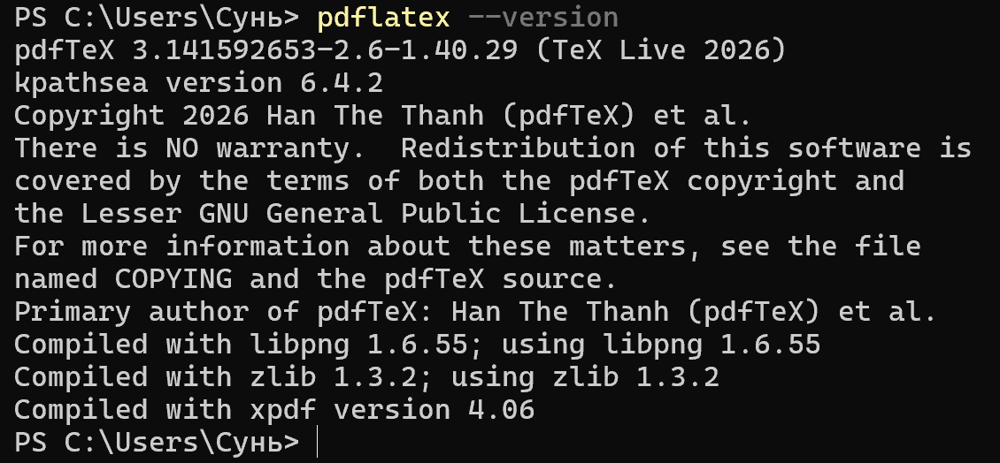
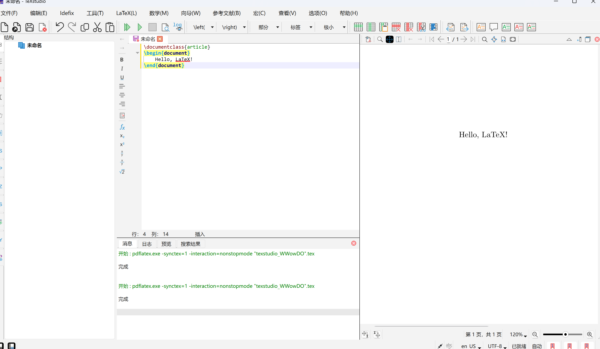
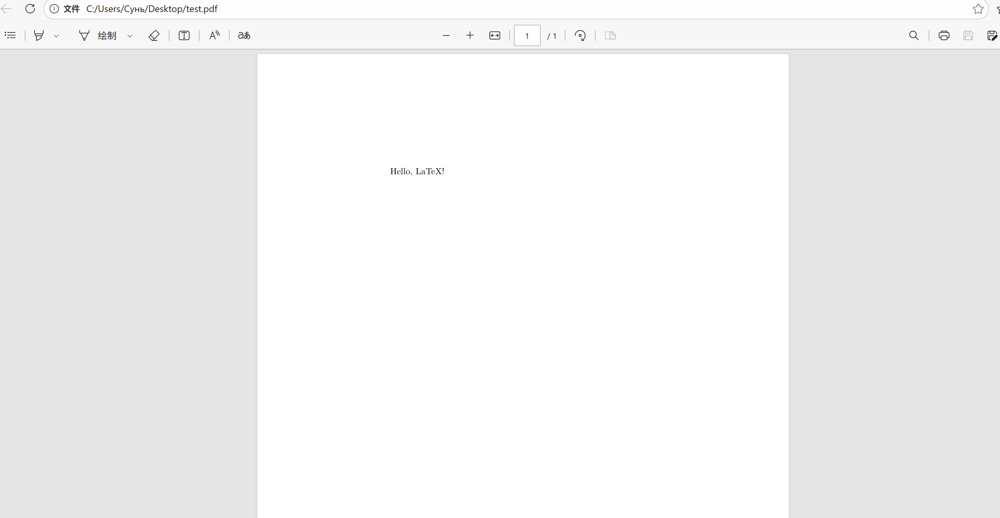

---
## Front matter
title: "Отчёт по лабораторной работе №1"
subtitle: "Computer Skills for Scientific Writing"
author: "Сунь Маосин"

## Generic otions
lang: ru-RU
toc-title: "Содержание"

## Pdf output format
toc: true
toc-depth: 2
lof: true
lot: true
fontsize: 12pt
linestretch: 1.5
papersize: a4
documentclass: scrreprt
## I18n polyglossia
polyglossia-lang:
  name: russian
  options:
    - spelling=modern
    - babelshorthands=true
polyglossia-otherlangs:
  name: english
## I18n babel
babel-lang: russian
babel-otherlangs: english
## Fonts
mainfont: Times New Roman
romanfont: Times New Roman
sansfont: Arial
monofont: Courier New
mathfont: Times New Roman
mainfontoptions: Ligatures=Common,Ligatures=TeX,Scale=0.94
romanfontoptions: Ligatures=Common,Ligatures=TeX,Scale=0.94
sansfontoptions: Ligatures=Common,Ligatures=TeX,Scale=MatchLowercase,Scale=0.94
monofontoptions: Scale=MatchLowercase,Scale=0.94,FakeStretch=0.9
## Pandoc-crossref LaTeX customization
figureTitle: "Рис."
tableTitle: "Таблица"
listingTitle: "Листинг"
lofTitle: "Список иллюстраций"
lotTitle: "Список таблиц"
lolTitle: "Листинги"
## Misc options
indent: true
header-includes:
  - \usepackage{indentfirst}
  - \usepackage{float}
  - \floatplacement{figure}{H}
---

# Цель работы

Изучение базовой структуры LaTeX-документа и принципов его компиляции в PDF-файл. В рамках работы рассматриваются создание минимального документа, настройка преамбулы, формирование тела документа, работа с абзацами, комментариями, специальными символами, а также основы структурирования текста и использования математического режима LaTeX.

# Ход выполнения

## Проверка установки LaTeX

Перед началом работы была выполнена проверка установленного дистрибутива LaTeX. Результат проверки показан на рисунке.

{ width=70% }

## Компиляция первого документа

Был создан файл `first.tex` и выполнена его компиляция командой `pdflatex first.tex`.

{ width=70% }

## Результат компиляции

В результате был получен PDF-файл с текстом "Hey world!" и "This is a first document".

{ width=70% }

# Вывод

В ходе выполнения работы были изучены основы работы с LaTeX. Все файлы успешно скомпилированы, ошибок нет.