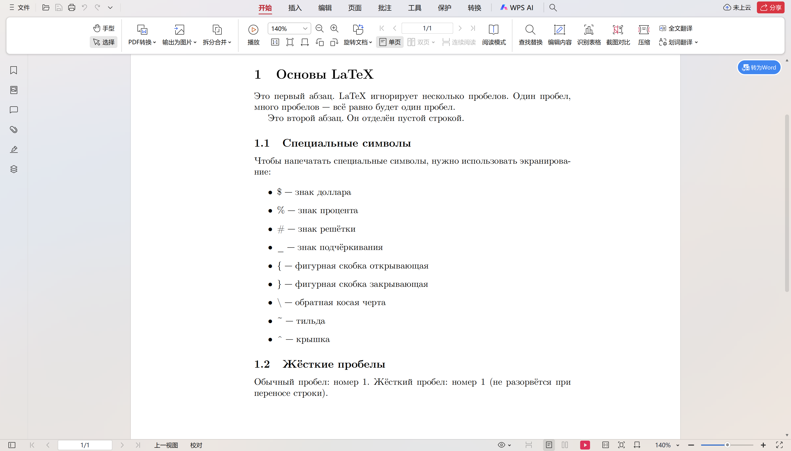

---
## Front matter
lang: ru-RU
title: Лабораторная работа №2
subtitle: структура документа LaTeX
author:
  - Сунь Маосин
institute:
  - Российский университет дружбы народов, Москва, Россия
date: 09 Марта 2026

## Formatting pdf
toc: false
slide_level: 2
aspectratio: 169
section-titles: true
theme: metropolis
header-includes:
 - \metroset{progressbar=frametitle,sectionpage=progressbar,numbering=fraction}
---

# Цель работы

## Основная цель
Основной целью данной работы является изучение базовых принципов логической структуры документа LaTeX и освоение основных приёмов работы с текстом

# Ход выполнения

## Среда и инструменты

В ходе работы использовались:
- дистрибутив **TeX Live 2026**;
- компилятор **pdflatex**;
- класс документа `article`;
- пакет `fontenc`.

# Exercise 2.1.4

## Компиляция исходного файла 

Файл `exercise_2_1_4.tex` был скомпилирован командой `pdflatex`.

## Особенности вывода:

Упражнение 1: Обработка пробелов. Независимо от числа пробелов в коде, LaTeX видит их как один.

Упражнение 2: Разделение на абзацы. Новый абзац создаётся пустой строкой.

Упражнение 3: Неразрывный пробел. Символ `~` не даёт словам разорваться при переносе. Используется в ссылках и инициалах.

Упражнение 4: Экранирование символов. Для вывода `{`, `}`, `$`, `%` нужно ставить перед ними `\`.

## код

## Результат компиляции

В итоговом PDF видно:
- абзацы отделены пустыми строками;
- лишние пробелы убраны;
- неразрывные пробелы работают.

## Pdf 

# Итоги работы

## Вывод

LaTeX использует логическую разметку — автор задаёт смысл, а оформление делает система.

LaTeX автоматически форматирует текст: убирает лишние пробелы, следит за переносами, даёт качественный результат.

Спецсимволы управляются экранированием. Важно помнить о парных командах `\begin` и `\end`.