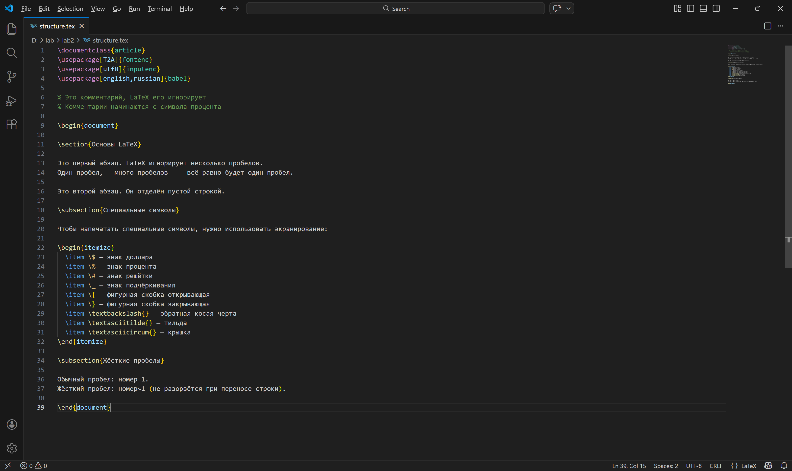

---
## Front matter
title: "Отчёт по лабораторной работе №2"
subtitle: "Computer Skills for Scientific Writing"
author: "Сунь Маосин"

## Generic otions
lang: ru-RU
toc-title: "Содержание"

## Bibliography
bibliography: bib/cite.bib
csl: pandoc/csl/gost-r-7-0-5-2008-numeric.csl

## Pdf output format
toc: true
toc-depth: 2
lof: true
lot: true
fontsize: 12pt
linestretch: 1.5
papersize: a4
documentclass: scrreprt
## I18n polyglossia
polyglossia-lang:
  name: russian
  options:
    - spelling=modern
    - babelshorthands=true
polyglossia-otherlangs:
  name: english
## I18n babel
babel-lang: russian
babel-otherlangs: english
## Fonts
mainfont: IBM Plex Serif
romanfont: IBM Plex Serif
sansfont: IBM Plex Sans
monofont: IBM Plex Mono
mathfont: STIX Two Math
mainfontoptions: Ligatures=Common,Ligatures=TeX,Scale=0.94
romanfontoptions: Ligatures=Common,Ligatures=TeX,Scale=0.94
sansfontoptions: Ligatures=Common,Ligatures=TeX,Scale=MatchLowercase,Scale=0.94
monofontoptions: Scale=MatchLowercase,Scale=0.94,FakeStretch=0.9
mathfontoptions:
## Biblatex
biblatex: true
biblio-style: "gost-numeric"
biblatexoptions:
  - parentracker=true
  - backend=biber
  - hyperref=auto
  - language=auto
  - autolang=other*
  - citestyle=gost-numeric
## Pandoc-crossref LaTeX customization
figureTitle: "Рис."
tableTitle: "Таблица"
listingTitle: "Листинг"
lofTitle: "Список иллюстраций"
lotTitle: "Список таблиц"
lolTitle: "Листинги"
## Misc options
indent: true
header-includes:
  - \usepackage{indentfirst}
  - \usepackage{float}
  - \floatplacement{figure}{H}
---

# Цель работы

Основной целью данной работы является изучение базовых принципов логической структуры документа LaTeX, а также освоение практических навыков работы с текстом, включая форматирование абзацев, обработку пробелов и использование специальных символов.

# Ход выполнения

## Компиляция и проверка файла `exercise.tex`

В ходе выполнения работы был создан тестовый файл `exercise.tex`, демонстрирующий основные возможности LaTeX по работе с текстом.

**Упражнение 1: Обработка пробелов.**  
Независимо от количества пробелов между словами в исходном коде, LaTeX интерпретирует их как один пробел. Например, фразы "один пробел" и "много     пробелов" в итоговом документе выглядят одинаково.

**Упражнение 2: Разделение на абзацы.**  
В LaTeX новый абзац создаётся с помощью одной или нескольких пустых строк. Это позволяет логически структурировать текст без необходимости вручную добавлять отступы.

**Упражнение 3: Неразрывный пробел (тильда).**  
Символ `~` создаёт неразрывный пробел, который предотвращает перенос строки между словами. Это особенно полезно при оформлении инициалов (например, `А.С.~Пушкин`), номеров (`Рис.~1`) или ссылок (`стр.~5`).

**Упражнение 4: Экранирование специальных символов.**  
Для отображения символов, имеющих специальное значение в LaTeX (таких как `{`, `}`, `$`, `%`, `_`, `#`), необходимо использовать экранирование обратным слешем. Например, `\$` выведет знак доллара, а `\%` — знак процента.

Результат компиляции файла представлен на скриншоте:

## Результат выполнения упражнений

Полученный PDF-документ `exercise.pdf` наглядно демонстрирует:

- корректное разбиение текста на абзацы с помощью пустых строк;
- автоматическое сжатие множественных пробелов до одинарных;
- применение неразрывных пробелов в инициалах и ссылках;
- правильное отображение заэкранированных специальных символов.

# Вывод

В результате выполнения лабораторной работы были сделаны следующие выводы:

**Принцип логической разметки.**  
LaTeX отличается от текстовых процессоров типа Microsoft Word тем, что автор работает не с визуальным представлением, а с логической структурой документа. Это позволяет сосредоточиться на содержании, а не на форматировании.

**Автоматизация оформления.**  
Система LaTeX автоматически обрабатывает множество рутинных задач: объединяет множественные пробелы, управляет переносами строк, формирует отступы абзацев. Это обеспечивает профессиональное качество типографики без дополнительных усилий.

**Контроль над специальными символами.**  
Механизм экранирования даёт полный контроль над отображением служебных символов. При этом важно строго соблюдать синтаксис LaTeX: все окружения должны быть правильно открыты и закрыты (например, парные команды `\begin` и `\end`).