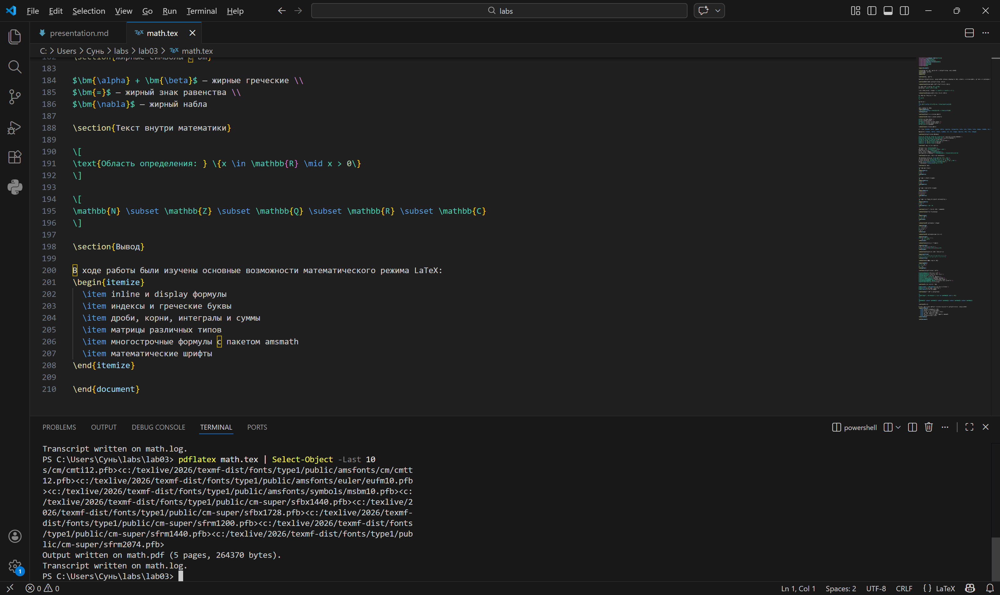
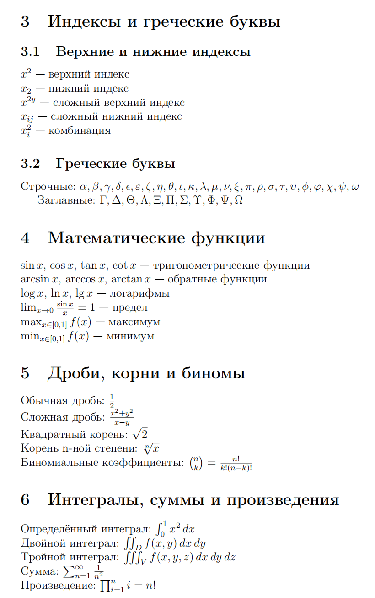

---
## Front matter
lang: ru-RU
title: Лабораторная работа №3
subtitle: Математический режим LaTeX
author:
  - Сунь Маосин
institute:
  - Российский университет дружбы народов, Москва, Россия
date: 2026

## Formatting pdf
toc: false
slide_level: 2
aspectratio: 169
section-titles: true
theme: metropolis
fontsize: 12pt
mainfont: Times New Roman
sansfont: Arial
monofont: Courier New
mathfont: Cambria Math

header-includes:
 - \metroset{progressbar=frametitle,sectionpage=progressbar,numbering=fraction}
 - \usepackage{fontspec}
 - \setmainfont{Times New Roman}
 - \setsansfont{Arial}
 - \setmonofont{Courier New}
---

# Цель работы

## Основная цель

Изучение математического режима LaTeX: inline и display формулы, индексы, греческие буквы, матрицы и выравнивание с помощью пакета amsmath.

# Ход выполнения

## Компиляция исходного файла

Файл `math.tex` был открыт в текстовом редакторе и скомпилирован с помощью команды `pdflatex`.

Использовались:
- TeX Live 2026  
- класс документа `article`  
- пакеты `amsmath`, `amssymb`, `bm`

## Компиляция math.tex

## Полученный результат

В ходе работы были протестированы различные элементы математического режима:

- Inline формулы: формулы внутри текста выглядят компактно, например E = mc2, a2 + b2 = c2
- Display формулы: формулы на отдельной строке выглядят крупнее, например интеграл или сумма ряда
- Нумерованные формулы: уравнения с автоматической нумерацией

## Результат работы

## Индексы и греческие буквы

Были изучены способы записи:

- Верхние и нижние индексы: x в квадрате, x с индексом 2, x в степени 2y, x с индексами ij, x в квадрате с индексом i
- Греческие буквы: альфа, бета, гамма, дельта, эпсилон, фи, омега (строчные) и Гамма, Дельта, Тета, Омега (заглавные)

## Математические функции и операторы

- Тригонометрические функции: синус, косинус, тангенс, котангенс
- Обратные функции: арксинус, арккосинус, арктангенс
- Логарифмы: логарифм, натуральный логарифм, десятичный логарифм
- Пределы: предел
- Максимум и минимум: максимум, минимум

## Дроби, корни и биномы

- Обычные и сложные дроби: одна вторая, (x2+y2)/(x-y)
- Квадратные корни и корни n-ной степени: квадратный корень из двух, корень n-ной степени из x
- Биномиальные коэффициенты: C из n по k

## Интегралы, суммы и произведения

- Определённые интегралы: интеграл от a до b
- Двойные и тройные интегралы: двойной интеграл, тройной интеграл
- Суммы: сумма
- Произведения: произведение

## Матрицы различных типов

- Матрица без скобок
- Матрица в круглых скобках
- Матрица в квадратных скобках
- Определитель в вертикальных линиях

## Матрицы

## Многострочные формулы с amsmath

- Системы уравнений с помощью окружения cases
- Выравнивание с align с номерами и без
- Несколько столбцов выравнивания
- Длинные формулы с переносом
- Группировка формул

## Математические шрифты

- mathrm прямой шрифт
- mathit курсив для слов
- mathbf жирный
- mathsf рубленый
- mathtt пишущая машинка
- mathcal каллиграфический
- mathbb двойной для множеств
- mathfrak готический

## Жирные символы с пакетом bm

- Команда mathbf делает буквы жирными и прямыми, но не работает для греческих символов
- Команда bm из пакета bm позволяет сделать жирным любой символ, включая греческие буквы: альфа + бета в жирном начертании
- Жирный знак равенства
- Жирный символ набла

## Текст внутри математики

- Использование команды text для вставки обычного текста в математические формулы
- Пример: обозначение области определения множества

## Итоговый результат

# Итоги работы

## Вывод

Выполнение работы показало, что LaTeX предоставляет очень гибкие инструменты для набора математики. Были изучены:

- inline и display формулы
- индексы и греческие буквы
- дроби, корни, интегралы и суммы
- матрицы различных типов
- многострочные формулы с пакетом amsmath
- математические шрифты
- жирные символы с пакетом bm

Все файлы были успешно скомпилированы, полученный PDF-документ полностью соответствует ожидаемым результатам.