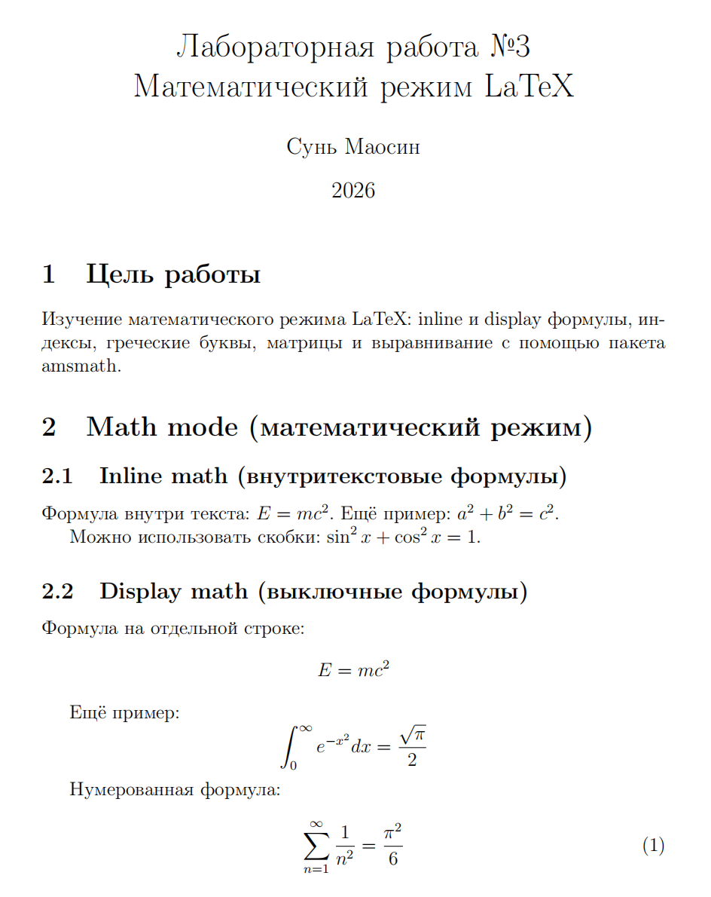

---
## Front matter
title: "Отчёт по лабораторной работе №3"
subtitle: "Computer Skills for Scientific Writing"
author: "Сунь Маосин"

## Generic otions
lang: ru-RU
toc-title: "Содержание"

## Bibliography
bibliography: bib/cite.bib
csl: pandoc/csl/gost-r-7-0-5-2008-numeric.csl

## Pdf output format
toc: true
toc-depth: 2
lof: true
lot: true
fontsize: 12pt
linestretch: 1.5
papersize: a4
documentclass: scrreprt
## I18n polyglossia
polyglossia-lang:
  name: russian
  options:
    - spelling=modern
    - babelshorthands=true
polyglossia-otherlangs:
  name: english
## I18n babel
babel-lang: russian
babel-otherlangs: english
## Fonts
mainfont: Times New Roman
romanfont: Times New Roman
sansfont: Arial
monofont: Courier New
mathfont: Cambria Math
mainfontoptions: Ligatures=Common,Ligatures=TeX,Scale=0.94
romanfontoptions: Ligatures=Common,Ligatures=TeX,Scale=0.94
sansfontoptions: Ligatures=Common,Ligatures=TeX,Scale=MatchLowercase,Scale=0.94
monofontoptions: Scale=MatchLowercase,Scale=0.94,FakeStretch=0.9
mathfontoptions:
## Biblatex
biblatex: true
biblio-style: "gost-numeric"
biblatexoptions:
  - parentracker=true
  - backend=biber
  - hyperref=auto
  - language=auto
  - autolang=other*
  - citestyle=gost-numeric
## Pandoc-crossref LaTeX customization
figureTitle: "Рис."
tableTitle: "Таблица"
listingTitle: "Листинг"
lofTitle: "Список иллюстраций"
lotTitle: "Список таблиц"
lolTitle: "Листинги"
## Misc options
indent: true
header-includes:
  - \usepackage{indentfirst}
  - \usepackage{float}
  - \floatplacement{figure}{H}
---

# Цель работы

Изучение математического режима LaTeX: inline и display формулы, индексы, греческие буквы, матрицы и выравнивание с помощью пакета amsmath.

# Ход выполнения

## Компиляция исходного файла

На первом этапе был открыт исходный файл `math.tex` и выполнена его компиляция командой `pdflatex`. В процессе компиляции использовался дистрибутив **TeX Live 2026** и пакет `amsmath`.

Результат выполнения команды показан на скриншоте:

## Анализ сгенерированного документа

Сформированный PDF-файл содержит несколько разделов, демонстрирующих различные возможности математического режима LaTeX.

В документе представлены следующие элементы:

- Режимы отображения:
  - Inline (строчный): Математические символы внутри текстовой строки, например формула E = mc²
  - Display (выключной): Выделенные формулы на отдельной строке, например интеграл от 0 до бесконечности
  - Нумерованная формула: сумма ряда

- Индексы и греческие буквы:
  - Верхние и нижние индексы: x², x₂, x^{2y}, x_{ij}, x²_i
  - Греческие буквы: α, β, γ, δ, ε, φ, ω (строчные) и Γ, Δ, Θ, Ω (заглавные)

- Математические функции: sin x, cos x, log x, lim

- Дроби, корни и биномы: обычные и сложные дроби, квадратные корни, корни n-ной степени, биномиальные коэффициенты

- Интегралы, суммы и произведения: определённые интегралы, двойные и тройные интегралы, суммы, произведения

- Матрицы различных типов:
  - Матрица без скобок
  - Матрица в круглых скобках
  - Матрица в квадратных скобках
  - Определитель (в вертикальных линиях)

- Многострочные формулы с amsmath:
  - Системы уравнений
  - Выравнивание с номерами и без номеров
  - Несколько столбцов выравнивания
  - Длинные формулы с переносом
  - Группировка формул

- Математические шрифты: прямой шрифт, курсив, жирный, рубленый, пишущая машинка, каллиграфический, двойной (для множеств), готический

- Жирные символы с пакетом bm: жирные греческие буквы, жирный знак равенства, жирный набла

- Текст внутри математики: обозначение области определения

# Вывод

В ходе выполнения работы были изучены основные возможности математического режима LaTeX:

- inline и display формулы;
- индексы и греческие буквы;
- дроби, корни, интегралы и суммы;
- матрицы различных типов;
- многострочные формулы с пакетом amsmath;
- математические шрифты и жирные символы с пакетом bm.

Все файлы были корректно скомпилированы, а результаты соответствуют ожидаемому поведению математического набора LaTeX.