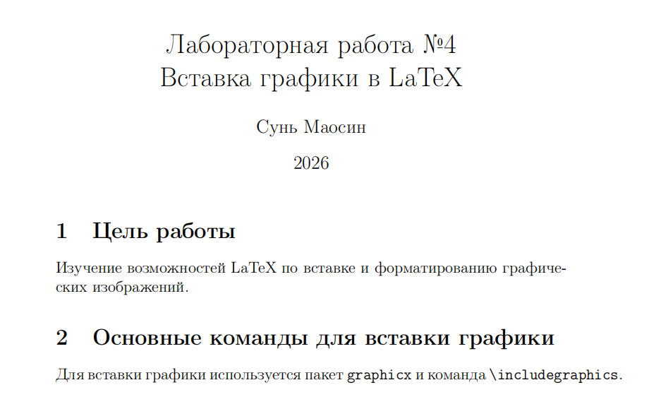
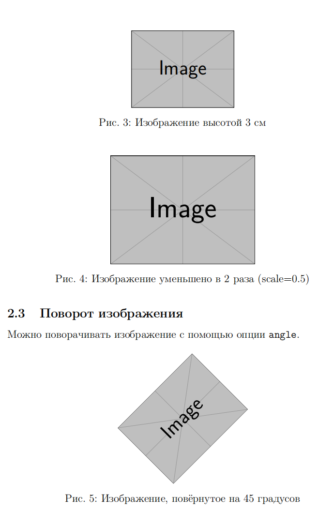

---
## Front matter
lang: ru-RU
title: Лабораторная работа №4
subtitle: Вставка графики в LaTeX
author:
  - Сунь Маосин
institute:
  - Российский университет дружбы народов, Москва, Россия
date: 2026

## Formatting pdf
toc: false
slide_level: 2
aspectratio: 169
section-titles: true
theme: metropolis
fontsize: 12pt
mainfont: Times New Roman
sansfont: Arial
monofont: Courier New

header-includes:
 - \metroset{progressbar=frametitle,sectionpage=progressbar,numbering=fraction}
 - \usepackage{fontspec}
 - \setmainfont{Times New Roman}
 - \setsansfont{Arial}
 - \setmonofont{Courier New}
---

# Цель работы

## Основная цель

Изучение возможностей LaTeX по вставке и форматированию графических изображений.

# Ход выполнения

## Компиляция исходного файла

Файл `graphics.tex` был открыт в текстовом редакторе и скомпилирован с помощью команды `pdflatex`.

Использовались:
- TeX Live 2026
- класс документа `article`
- пакет `graphicx` для работы с графикой

## Компиляция graphics.tex

## Страница 1: Титульный лист и цель работы

На первой странице представлены:
- титульный лист с названием работы, автором и датой
- цель работы
- начало раздела об основных командах для вставки графики

## Страница 2: Простая вставка и изменение ширины

На второй странице показаны:
- рисунок 1: простая вставка изображения без изменения размера
- рисунок 2: изображение с изменённой шириной

## Страница 3: Изменение высоты, масштабирование и поворот

На третьей странице представлены:
- рисунок 3: изображение с заданной высотой
- рисунок 4: масштабированное изображение
- рисунок 5: изображение, повёрнутое на 45 градусов

## Страница 4: Плавающие окружения и несколько изображений

На четвёртой странице показаны:
- рисунок 6: пример плавающего окружения figure
- рисунки 7-9: три изображения, размещённые с помощью minipage
- рисунок 10: общий заголовок для трёх изображений

## Страница 5: Subfigure, перекрёстные ссылки и вывод

На пятой странице представлены:
- рисунок 11: три изображения с помощью subfigure
- перекрёстные ссылки на рисунки
- вывод со списком изученных возможностей

## Перекрёстные ссылки

В документе были протестированы перекрёстные ссылки на рисунки. Для корректного отображения номеров рисунков требуется несколько компиляций.

## Итоговый результат

# Итоги работы

## Вывод

В ходе выполнения лабораторной работы были изучены:

- вставка изображений с помощью пакета graphicx
- изменение размера изображений с помощью опций width, height и scale
- поворот изображений с помощью опции angle
- использование плавающего окружения figure
- размещение нескольких изображений рядом с помощью minipage и subfigure
- перекрёстные ссылки на рисунки

Все файлы были успешно скомпилированы, полученный PDF-документ полностью соответствует ожидаемым результатам.