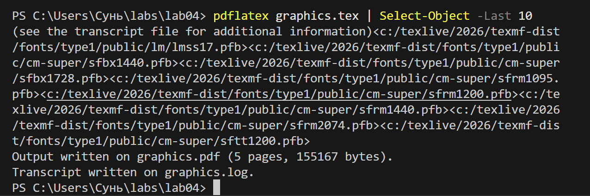
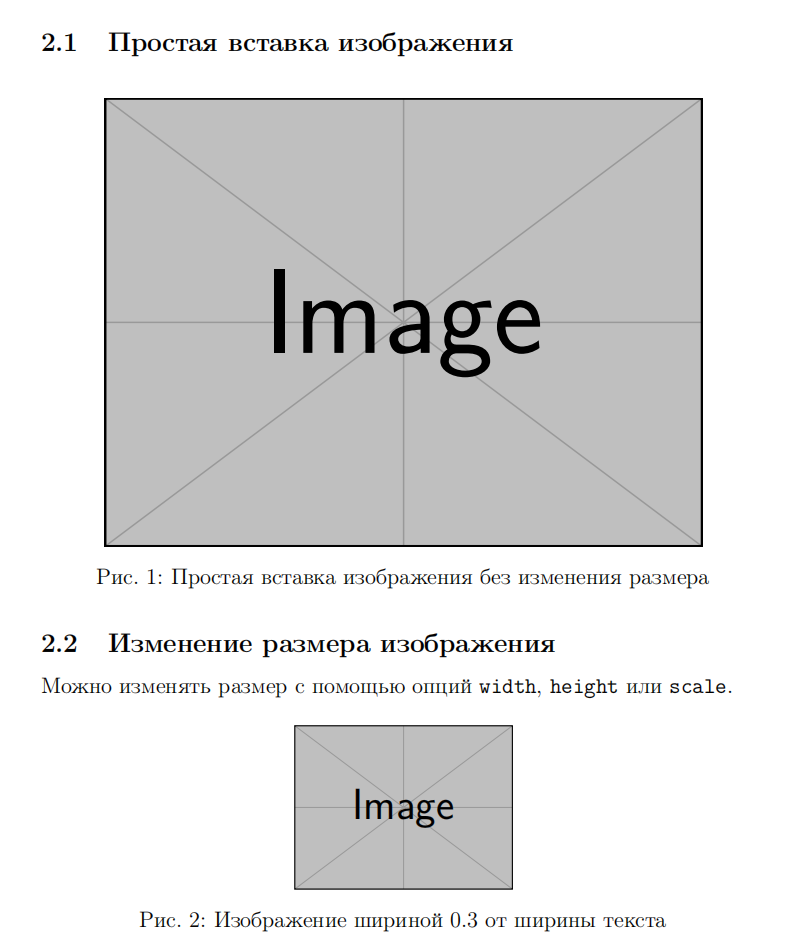
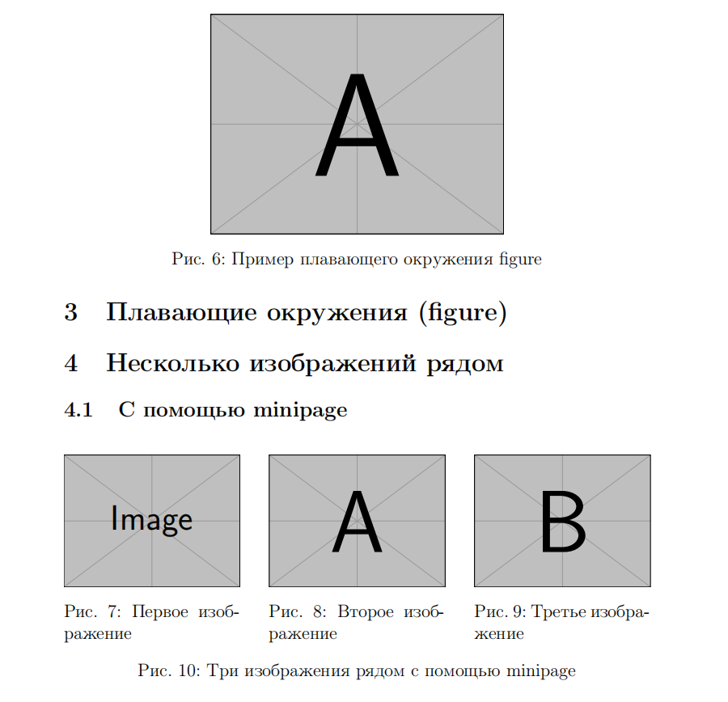
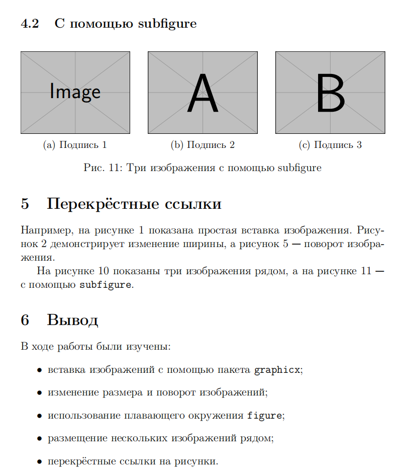

---
## Front matter
title: "Отчёт по лабораторной работе №4"
subtitle: "Computer Skills for Scientific Writing"
author: "Сунь Маосин"

## Generic otions
lang: ru-RU
toc-title: "Содержание"

## Pdf output format
toc: true
toc-depth: 2
lof: true
lot: true
fontsize: 12pt
linestretch: 1.5
papersize: a4
documentclass: scrreprt
## I18n polyglossia
polyglossia-lang:
  name: russian
  options:
    - spelling=modern
    - babelshorthands=true
polyglossia-otherlangs:
  name: english
## I18n babel
babel-lang: russian
babel-otherlangs: english
## Fonts
## Fonts
mainfont: Times New Roman
romanfont: Times New Roman
sansfont: Arial
monofont: Courier New
mathfont: Times New Roman
mainfontoptions: Ligatures=Common,Ligatures=TeX,Scale=0.94
romanfontoptions: Ligatures=Common,Ligatures=TeX,Scale=0.94
sansfontoptions: Ligatures=Common,Ligatures=TeX,Scale=MatchLowercase,Scale=0.94
monofontoptions: Scale=MatchLowercase,Scale=0.94,FakeStretch=0.9
mathfontoptions:
## Biblatex
biblatex: true
biblio-style: "gost-numeric"
biblatexoptions:
  - parentracker=true
  - backend=biber
  - hyperref=auto
  - language=auto
  - autolang=other*
  - citestyle=gost-numeric
## Pandoc-crossref LaTeX customization
figureTitle: "Рис."
tableTitle: "Таблица"
listingTitle: "Листинг"
lofTitle: "Список иллюстраций"
lotTitle: "Список таблиц"
lolTitle: "Листинги"
## Misc options
indent: true
header-includes:
  - \usepackage{indentfirst}
  - \usepackage{float}
  - \floatplacement{figure}{H}
---

# Цель работы

Изучение возможностей LaTeX по вставке и форматированию графических изображений.

# Ход выполнения

## Компиляция исходного файла

На первом этапе был открыт исходный файл `graphics.tex` и выполнена его компиляция командой `pdflatex`. В процессе компиляции использовался дистрибутив **TeX Live 2026** и пакет `graphicx`.

Результат выполнения команды показан на скриншоте:

## Анализ сгенерированного документа

Сформированный PDF-файл содержит 5 страниц, демонстрирующих различные способы вставки и форматирования графики.

На первой странице представлены титульный лист с названием работы, автором и датой, а также цель работы и начало раздела об основных командах для вставки графики.

На второй странице показаны:
- **Рисунок 1**: Простая вставка изображения без изменения размера
- **Рисунок 2**: Изображение шириной 0.3 от ширины текста

На третьей странице представлены:
- **Рисунок 3**: Изображение высотой 3 см
- **Рисунок 4**: Изображение уменьшено в 2 раза
- **Рисунок 5**: Изображение, повёрнутое на 45 градусов

На четвёртой странице показаны:
- **Рисунок 6**: Пример плавающего окружения figure
- **Рисунки 7-10**: Три изображения рядом с помощью minipage

На пятой странице представлены:
- **Рисунок 11**: Три изображения с помощью subfigure
- **Перекрёстные ссылки**: Примеры ссылок на рисунки
- **Вывод**: Список изученных возможностей

# Вывод

В ходе выполнения лабораторной работы были изучены:

- вставка изображений с помощью пакета `graphicx`;
- изменение размера изображений с помощью опций width, height и scale;
- поворот изображений с помощью опции angle;
- использование плавающего окружения `figure`;
- размещение нескольких изображений рядом с помощью minipage и subfigure;
- перекрёстные ссылки на рисунки.

Все файлы были успешно скомпилированы, полученный PDF-документ полностью соответствует ожидаемым результатам.