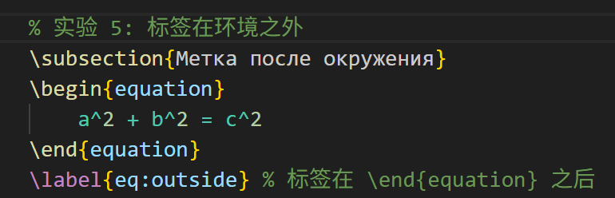

---
## Front matter
title: "Отчёт по лабораторной работе №4"
subtitle: "Computer Skills for Scientific Writing"
author: "Сунь Маосин"

## Generic otions
lang: ru-RU
toc-title: "Содержание"

## Pdf output format
toc: true
toc-depth: 2
lof: true
lot: true
fontsize: 12pt
linestretch: 1.5
papersize: a4
documentclass: scrreprt
## I18n polyglossia
polyglossia-lang:
  name: russian
  options:
    - spelling=modern
    - babelshorthands=true
polyglossia-otherlangs:
  name: english
## I18n babel
babel-lang: russian
babel-otherlangs: english
## Fonts
mainfont: Times New Roman
romanfont: Times New Roman
sansfont: Arial
monofont: Courier New
mathfont: Times New Roman
mainfontoptions: Ligatures=Common,Ligatures=TeX,Scale=0.94
romanfontoptions: Ligatures=Common,Ligatures=TeX,Scale=0.94
sansfontoptions: Ligatures=Common,Ligatures=TeX,Scale=MatchLowercase,Scale=0.94
monofontoptions: Scale=MatchLowercase,Scale=0.94,FakeStretch=0.9
mathfontoptions:
## Biblatex
biblatex: true
biblio-style: "gost-numeric"
biblatexoptions:
  - parentracker=true
  - backend=biber
  - hyperref=auto
  - language=auto
  - autolang=other*
  - citestyle=gost-numeric
## Pandoc-crossref LaTeX customization
figureTitle: "Рис."
tableTitle: "Таблица"
listingTitle: "Листинг"
lofTitle: "Список иллюстраций"
lotTitle: "Список таблиц"
lolTitle: "Листинги"
## Misc options
indent: true
header-includes:
  - \usepackage{indentfirst}
  - \usepackage{float}
  - \floatplacement{figure}{H}
---

# Цель работы

Изучение основных и расширенных способов включения, оформления и размещения графических изображений в документах, создаваемых с использованием системы вёрстки **LaTeX**.

# Ход выполнения

# Параметры трансформации

Я протестировал ключи `height`, `width`, `angle` и `scale` в команде `\includegraphics`. Это позволило мне изменять размер картинки, поворачивать её и пропорционально масштабировать.

## Компиляция 

## Результат

# Относительная ширина

Я задавал размеры фото относительно `\textwidth` и `\linewidth`. Я заметил, что при использовании twocolumn (две колонки) изображение подстраивается под ширину колонки, если использовать `\linewidth`.

## Компиляция 

## Результат

## Размещение и lipsum

Я добавил много текста с помощью lipsum, чтобы увидеть, как работают «плавающие» рисунки. Я пробовал ставить `[h]`, `[t]`, `[b]` и `[p]`, чтобы понять, как LaTeX переносит картинку наверх или в конец страницы.

## Компиляция 

## Результат

## Эксперимент с `\label`

Я ставил метку `\label` до и после команды `\caption`. Я подтвердил, что если поставить `\label` перед заголовком, то ссылка в тексте будет неправильной и укажет на номер раздела, а не рисунка.

## Компиляция 

## Результат

## Ссылки и компиляция

Я узнал, что нужно запускать pdflatex 2–3 раза, чтобы вместо знаков `??` появились правильные номера. Также я использовал тильду `~` перед ссылкой, чтобы номер не отрывался от слова при переносе строки.

## Компиляция 

## Результат

# Вывод

В ходе выполнения лабораторной работы №4 я освоил основные инструменты LaTeX для работы с внешней графикой. Я научился использовать пакет graphicx и его ключевую команду `\includegraphics`, которая позволяет гибко настраивать размеры, масштаб и угол наклона изображений.

Особое внимание я уделил изучению «плавающих» объектов (окружение figure). Я понял, как работают спецификаторы размещения `[h]`, `[t]`, `[b]`, `[p]` и как пакет float с опцией `[H]` помогает жестко закрепить рисунок в нужном месте. Также я экспериментально подтвердил, что для корректной работы перекрестных ссылок через `\ref` метка `label` должна всегда находиться после команды `\caption`. Эти навыки позволяют мне создавать профессионально оформленные научные документы с автоматической нумерацией и качественной типографикой.