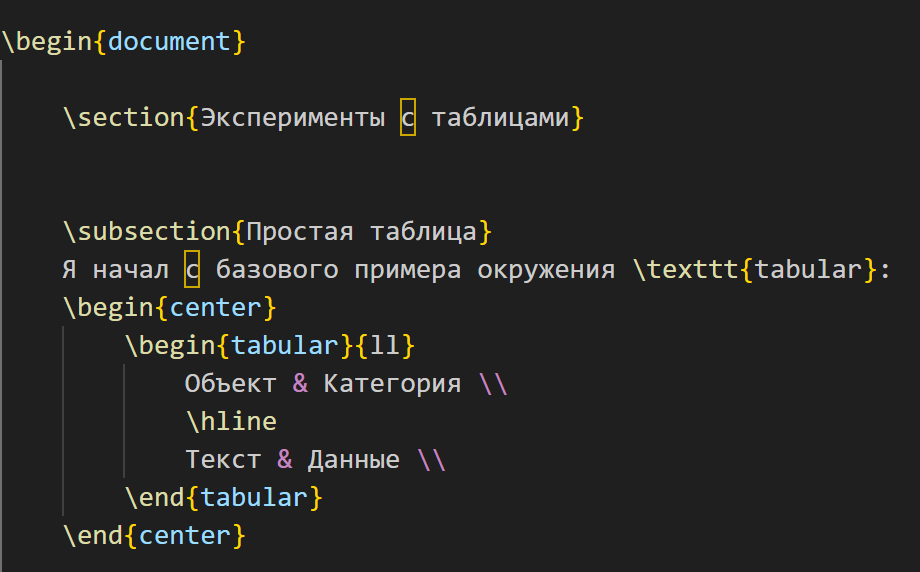
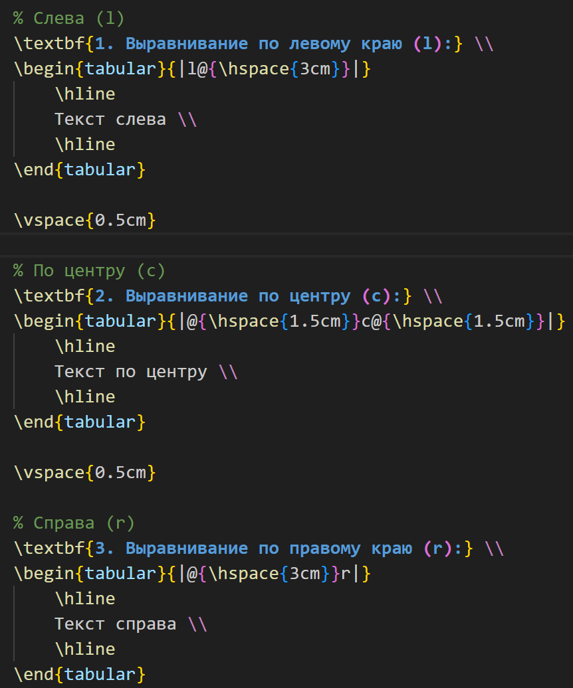
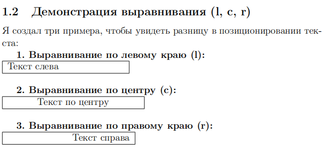
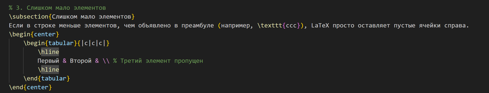
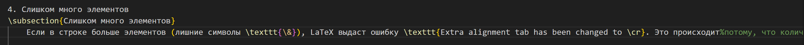
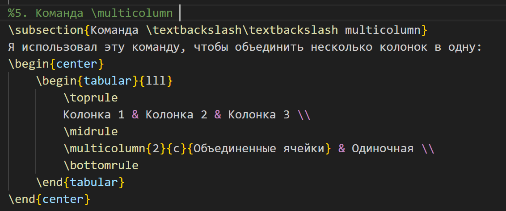

---
## Front matter
lang: ru-RU
title: Лабораторная работа №5
subtitle: Таблицы в LaTeX
author:
  - Сунь Маосин
institute:
  - Российский университет дружбы народов, Москва, Россия
date: 11 Марта 2026

## Formatting pdf
toc: false
slide_level: 2
aspectratio: 169
section-titles: true
theme: metropolis
header-includes:
 - \metroset{progressbar=frametitle,sectionpage=progressbar,numbering=fraction}
 - \usepackage{fontspec}
 - \setmainfont{Times New Roman}
 - \setsansfont{Arial}
 - \setmonofont{Courier New}
---

# Цель работы

## Основная цель

Освоение работы с таблицами в **LaTeX**, включая базовое и продвинутое форматирование.

# Создание простых таблиц

## Компиляция таблиц из исходных файлов

Я начал с создания самой простой таблицы, используя окружение tabular. Это помогло мне понять базовую структуру: использование символа `&` для разделения колонок и `\\` для перехода на новую строку.

##

## Полученный результат

Готовый PDF содержит:

## Использование `l`, `c`, `r`

Я создал три отдельные таблицы с разным выравниванием. Я увидел, что `l` прижимает текст влево, `c` центрирует его, а `r` сдвигает вправо. Для наглядности я увеличил ширину ячеек.

В файле `lab05.tex` выполнены эксперименты:

- `l` — выравнивание по левому краю,
- `c` — по центру,
- `r` — по правому.

##

## Полученный результат

## Слишком мало элементов

В этом эксперименте я указал в строке меньше данных, чем было объявлено колонок. Я заметил, что LaTeX просто оставляет пустые места в правой части таблицы без вывода ошибок.

## Полученный результат

## Слишком много элементов

Я попробовал добавить лишние данные через символ `&.` Это привело к ошибке компиляции. Я понял, что количество разделителей должно строго соответствовать числу колонок, описанных в преамбуле таблицы.

## Полученный результат

## Команда \textbackslash multicolumn

Я использовал команду `\multicolumn` для горизонтального объединения нескольких ячеек. Это позволило мне создать заголовок, который красиво располагается сразу над двумя колонками, что делает таблицу профессиональнее.

## Полученный результат

# Итоги работы

## Вывод

В процессе выполнения практических заданий я реализовал следующие шаги:

  - Простой пример: Создал базовую таблицу, освоив использование & для колонок и `\\` для строк.

  - Выравнивание `(l, c, r)`: Протестировал режимы по левому краю, центру и правому краю. Для наглядности увеличил ширину ячеек.

  - Мало элементов: Убедился, что при недостатке данных в строке LaTeX просто оставляет пустые места справа без ошибок.

  - Много элементов: Выявил, что лишние разделители `&` приводят к ошибке компиляции, так как данные выходят за пределы колонок.

  - Команда `\textbackslash` multicolumn: Успешно объединил несколько ячеек по горизонтали для создания общего заголовка.

LaTeX позволяет создавать аккуратные и профессиональные таблицы для технических документов.
