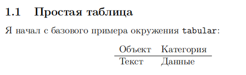
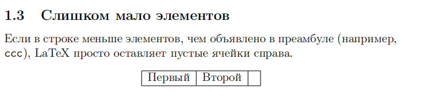
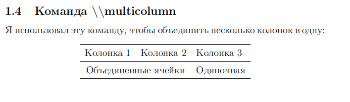

---
## Front matter
title: "Отчёт по лабораторной работе №5"
subtitle: "Computer Skills for Scientific Writing"
author: "Сунь Маосин"

## Generic otions
lang: ru-RU
toc-title: "Содержание"

## Pdf output format
toc: true
toc-depth: 2
lof: true
lot: true
fontsize: 12pt
linestretch: 1.5
papersize: a4
documentclass: scrreprt
## I18n polyglossia
polyglossia-lang:
  name: russian
  options:
    - spelling=modern
    - babelshorthands=true
polyglossia-otherlangs:
  name: english
## I18n babel
babel-lang: russian
babel-otherlangs: english
## Fonts
mainfont: Times New Roman
romanfont: Times New Roman
sansfont: Arial
monofont: Courier New
mathfont: Times New Roman
mainfontoptions: Ligatures=Common,Ligatures=TeX,Scale=0.94
romanfontoptions: Ligatures=Common,Ligatures=TeX,Scale=0.94
sansfontoptions: Ligatures=Common,Ligatures=TeX,Scale=MatchLowercase,Scale=0.94
monofontoptions: Scale=MatchLowercase,Scale=0.94,FakeStretch=0.9
mathfontoptions:
## Biblatex
biblatex: true
biblio-style: "gost-numeric"
biblatexoptions:
  - parentracker=true
  - backend=biber
  - hyperref=auto
  - language=auto
  - autolang=other*
  - citestyle=gost-numeric
## Pandoc-crossref LaTeX customization
figureTitle: "Рис."
tableTitle: "Таблица"
listingTitle: "Листинг"
lofTitle: "Список иллюстраций"
lotTitle: "Список таблиц"
lolTitle: "Листинги"
## Misc options
indent: true
header-includes:
  - \usepackage{indentfirst}
  - \usepackage{float}
  - \floatplacement{figure}{H}
---

# Цель работы

Освоение создания таблиц в системе вёрстки **LaTeX**, применение различных типов выравнивания столбцов, использование стилей колонок и продвинутого форматирования таблиц.

# Ход выполнения

## Создание простых таблиц

Эксперимент начался с создания простейшей таблицы через окружение `tabular`. Установлено, что структура таблицы жестко задается в преамбуле, где количество и тип столбцов определяют логику дальнейшего заполнения данными.

## Сравнительный анализ выравнивания (`l`, `c`, `r`)

  - l (left): Текст прижимается к левой границе, оставляя свободное пространство справа. Это стандарт для текстовых данных.

  - c (center): Текст располагается ровно посередине ячейки. Подходит для заголовков или числовых данных.

  - r (right): Текст прижимается к правой границе. Часто используется для выравнивания разрядов в финансовых таблицах.
Использование `\hspace` позволило наглядно увидеть, как LaTeX распределяет пустое пространство внутри ячейки в зависимости от выбранного флага.

## Недостаток элементов в строке:

При заполнении строки меньшим количеством данных (пропуск символа `&`), чем объявлено в преамбуле, система не выдает ошибку. Вместо этого в правой части таблицы формируются пустые ячейки, что позволяет создавать разреженные структуры данных.

## Избыток элементов и ошибки:

На основе эксперимента Было выявлено, что добавление лишних разделителей `&` нарушает структуру окружения и приводит к критической ошибке компиляции. Это подтверждает необходимость строгого соответствия данных объявленной конфигурации столбцов.

## Горизонтальное объединение

С помощью команды `\multicolumn` успешно реализовано объединение нескольких столбцов. Анализ показал, что данная команда не только визуально объединяет ячейки, но и позволяет переопределить стиль выравнивания (например, сменить `l` на `c`) для конкретной объединенной области.

# Вывод

Работа с таблицами в LaTeX требует четкого предварительного планирования структуры. Использование профессиональных инструментов, таких как `booktabs`, значительно улучшает эстетический вид таблиц, делая их пригодными для научных публикаций.