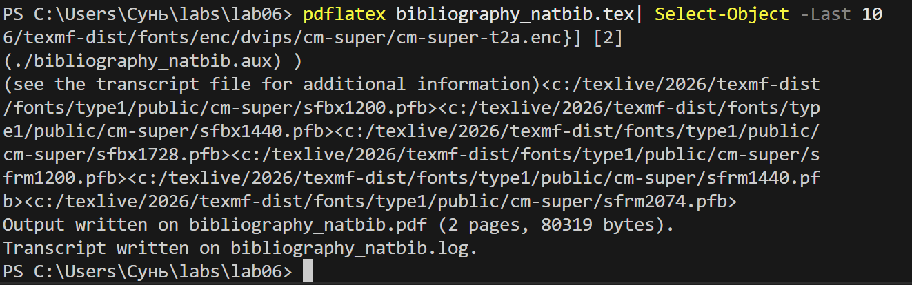
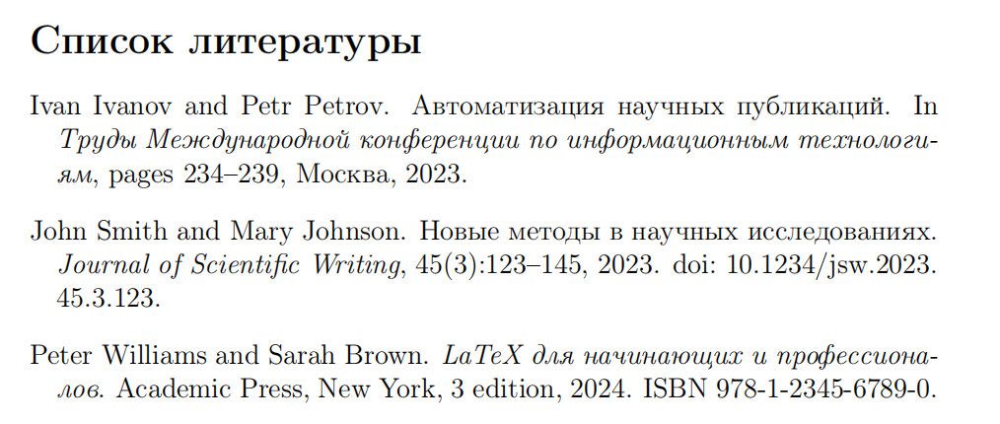
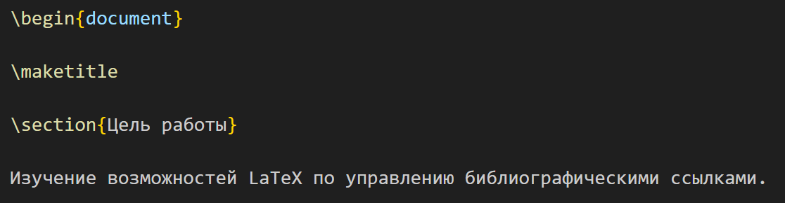
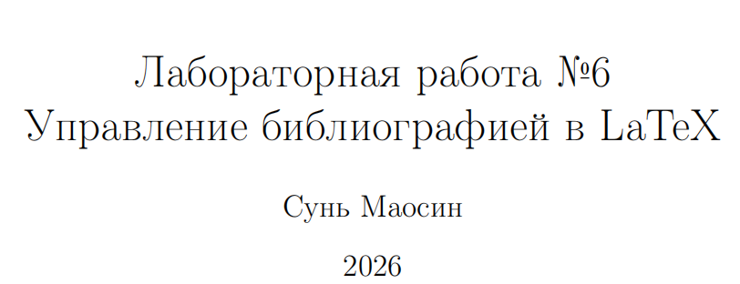

---
## Front matter
lang: ru-RU
title: Лабораторная работа №6
subtitle: Управление библиографией в LaTeX с помощью natbib
author:
  - Сунь Маосин
institute:
  - Российский университет дружбы народов, Москва, Россия
date: 2026

## Formatting pdf
toc: false
slide_level: 2
aspectratio: 169
section-titles: true
theme: metropolis
fontsize: 12pt

header-includes:
 - \metroset{progressbar=frametitle,sectionpage=progressbar,numbering=fraction}
 - \usepackage{fontspec}
 - \setmainfont{Times New Roman}
 - \setsansfont{Arial}
 - \setmonofont{Courier New}
---

# Цель работы

## Основная цель

Изучение возможностей LaTeX по управлению библиографическими ссылками с использованием пакета `natbib`.

# Ход выполнения

## Компиляция исходного файла

### Код начала документа

### Результат компиляции

Я открыл файл `bibliography_natbib.tex` в текстовом редакторе и выполнил его компиляцию с помощью команды `pdflatex`. Для корректного отображения ссылок потребовалось несколько компиляций: сначала `pdflatex`, затем `bibtex`, затем снова `pdflatex` дважды.

## База данных references.bib

### Код файла references.bib

### Список литературы в PDF

Я создал внешнюю базу данных в формате `.bib` с именем `references.bib`. Файл содержит четыре источника различных типов: статья, книга, материалы конференции и интернет-ресурс.

## Титульный лист

### Код титульного листа

### Титульный лист в PDF

На первой странице сгенерированного документа представлены титульный лист с названием работы, моим именем и датой, а также цель работы — изучение управления библиографическими ссылками.

## Текстовое цитирование (citet)

### Код текстового цитирования

### Результат в PDF

С помощью команды `\citet` я реализовал текстовое цитирование, где имена авторов являются частью предложения. Например: "Smith и др. показали, что LaTeX улучшает качество научных работ."

## Цитирование в скобках (citep)

### Код цитирования в скобках

### Результат в PDF

Команда `\citep` используется для цитирования в скобках, когда ссылка находится в конце предложения. Например: "Как показано в исследованиях (Ivanov и др., 2023)."

## Цитирование с указанием страниц

Пакет `natbib` позволяет добавлять номера страниц в квадратные скобки. Я использовал конструкции вида `\citet[p.~45]{smith2023}` для указания конкретной страницы и `\citep[см.][глава 2]{latex2024}` для добавления комментариев перед ссылкой.

## Множественное цитирование

Я также протестировал множественное цитирование нескольких источников одновременно с помощью команды `\citep{smith2023,latex2024,konference2023}`. Все три источника корректно отобразились в одной ссылке.

## Процесс компиляции с библиографией

Для корректной работы с библиографией я выполнил следующую последовательность команд:

1. `pdflatex bibliography_natbib.tex` — первая компиляция
2. `bibtex bibliography_natbib` — обработка библиографии
3. `pdflatex bibliography_natbib.tex` — вторая компиляция
4. `pdflatex bibliography_natbib.tex` — третья компиляция для финального результата

Только после полного цикла компиляции все ссылки отобразились корректно.

# Итоги работы

## Вывод

В ходе выполнения лабораторной работы я изучил основные возможности управления библиографией в LaTeX с помощью пакета `natbib`:

- создание базы данных `.bib` с различными типами источников (статья, книга, материалы конференции, интернет-ресурс);
- текстовое цитирование с помощью команды `\citet`;
- цитирование в скобках с помощью команды `\citep`;
- цитирование с указанием страниц и дополнительными комментариями;
- множественное цитирование нескольких источников;
- генерацию списка литературы с использованием стиля `plainnat`;
- последовательность компиляции для корректного отображения ссылок.

Все файлы были успешно скомпилированы, полученный PDF-документ полностью соответствует ожидаемым результатам.