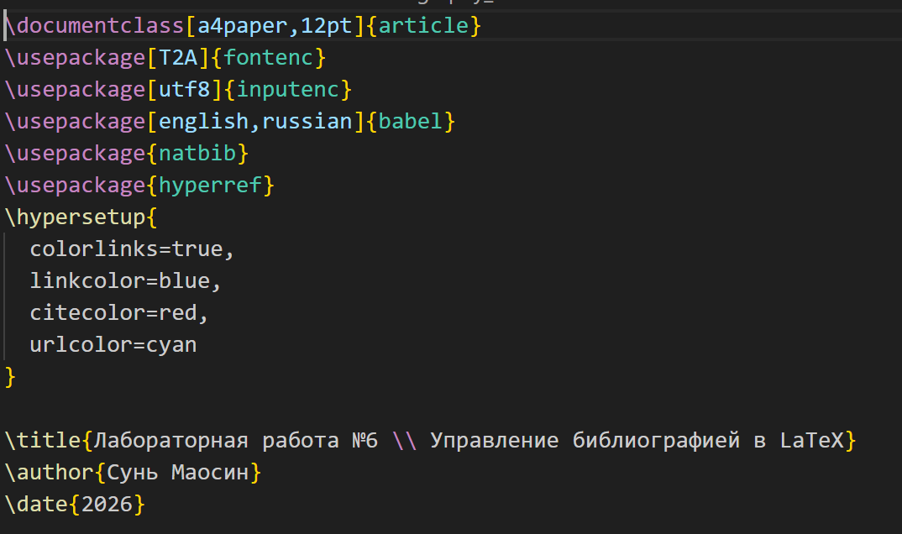
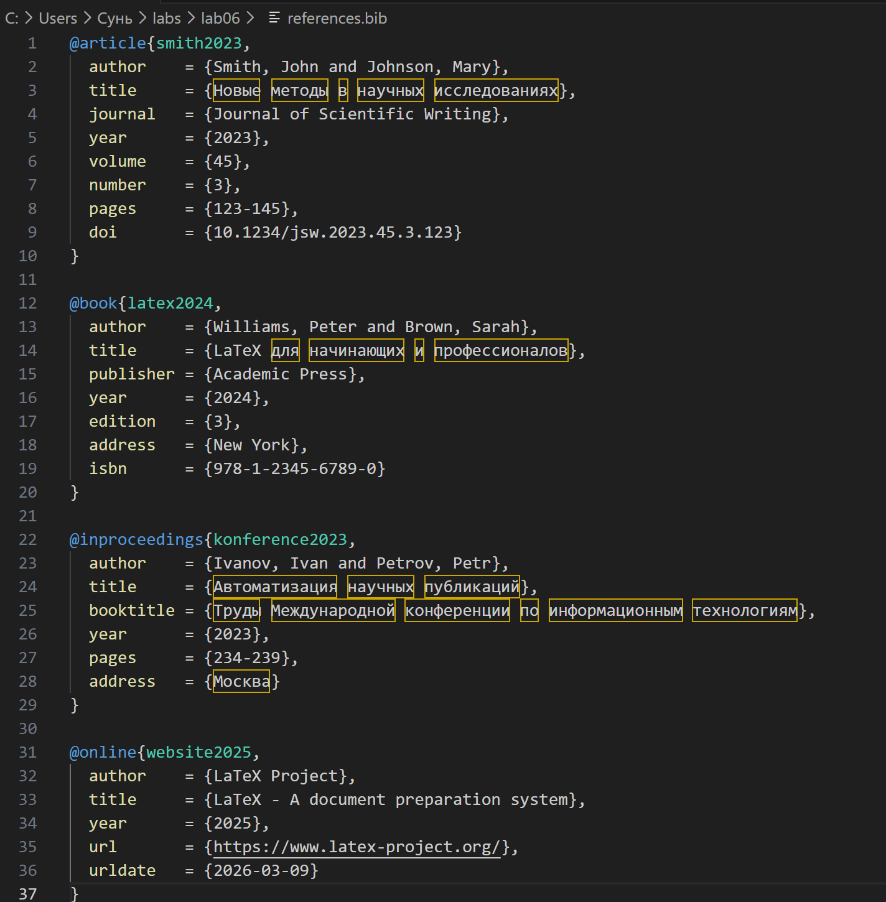
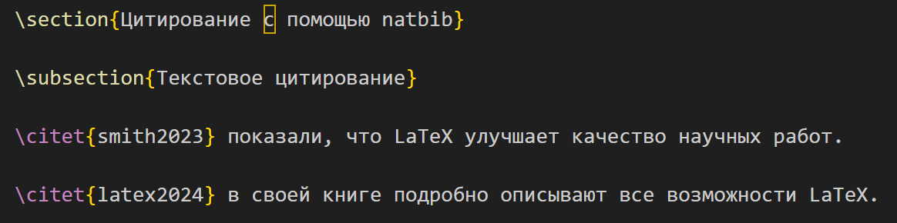
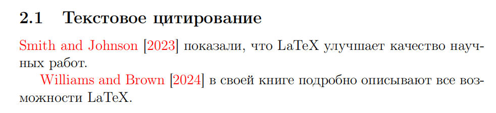
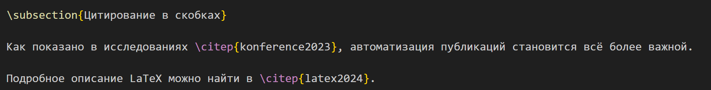
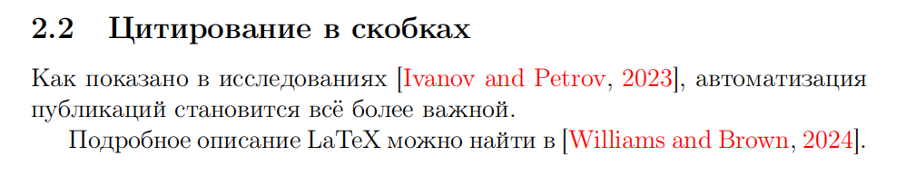

---
## Front matter
title: "Отчёт по лабораторной работе №6"
subtitle: "Computer Skills for Scientific Writing"
author: "Сунь Маосин"

## Generic otions
lang: ru-RU
toc-title: "Содержание"

## Pdf output format
toc: true
toc-depth: 2
lof: true
lot: true
fontsize: 12pt
linestretch: 1.5
papersize: a4
documentclass: scrreprt
## I18n polyglossia
polyglossia-lang:
  name: russian
  options:
    - spelling=modern
    - babelshorthands=true
polyglossia-otherlangs:
  name: english
## I18n babel
babel-lang: russian
babel-otherlangs: english
## Fonts
mainfont: Times New Roman
romanfont: Times New Roman
sansfont: Arial
monofont: Courier New
mathfont: Times New Roman
mainfontoptions: Ligatures=Common,Ligatures=TeX,Scale=0.94
romanfontoptions: Ligatures=Common,Ligatures=TeX,Scale=0.94
sansfontoptions: Ligatures=Common,Ligatures=TeX,Scale=MatchLowercase,Scale=0.94
monofontoptions: Scale=MatchLowercase,Scale=0.94,FakeStretch=0.9
mathfontoptions:
## Biblatex
biblatex: true
biblio-style: "gost-numeric"
biblatexoptions:
  - parentracker=true
  - backend=biber
  - hyperref=auto
  - language=auto
  - autolang=other*
  - citestyle=gost-numeric
## Pandoc-crossref LaTeX customization
figureTitle: "Рис."
tableTitle: "Таблица"
listingTitle: "Листинг"
lofTitle: "Список иллюстраций"
lotTitle: "Список таблиц"
lolTitle: "Листинги"
## Misc options
indent: true
header-includes:
  - \usepackage{indentfirst}
  - \usepackage{float}
  - \floatplacement{figure}{H}
---

# Цель работы

Изучение возможностей LaTeX по управлению библиографическими ссылками с использованием пакета `natbib`.

# Ход выполнения

## Компиляция исходного файла

### Код

### Результат компиляции

## База данных references.bib

### Код файла references.bib

### Список литературы в PDF

## Титульный лист

### Код титульного листа

### Титульный лист в PDF

## Текстовое цитирование (citet)

### Код

### Результат в PDF

## Цитирование в скобках (citep)

### Код

### Результат в PDF

## Цитирование с указанием страниц и множественное цитирование

Пакет `natbib` позволяет добавлять номера страниц в квадратные скобки: `\citet[p.~45]{smith2023}`. Также поддерживается множественное цитирование: `\citep{smith2023,latex2024,konference2023}`.

## Процесс компиляции с библиографией

Для корректной работы с библиографией необходимо выполнить следующую последовательность команд:

1. `pdflatex bibliography_natbib.tex` - первая компиляция
2. `bibtex bibliography_natbib` - обработка библиографии
3. `pdflatex bibliography_natbib.tex` - вторая компиляция
4. `pdflatex bibliography_natbib.tex` - третья компиляция для финального результата

# Вывод

В ходе выполнения лабораторной работы были изучены основные возможности управления библиографией в LaTeX с помощью пакета `natbib`:

- создание базы данных `.bib` с различными типами источников;
- текстовое цитирование с помощью команды `\citet`;
- цитирование в скобках с помощью команды `\citep`;
- цитирование с указанием страниц;
- множественное цитирование;
- генерация списка литературы с использованием стиля `plainnat`;
- последовательность компиляции для корректного отображения ссылок.

Все файлы были успешно скомпилированы, полученный PDF-документ полностью соответствует ожидаемым результатам.