# Цель работы

## Основная цель

Изучить приёмы создания презентаций в LaTeX с использованием класса beamer, включая:

- структуру слайдов;
- работу с блоками (block, exampleblock, alertblock);
- пошаговое раскрытие элементов с помощью команды pause;
- точное управление отображением через команду uncover;
- многоколоночную верстку;
- вставку математических формул и таблиц.

# Структура презентации в Beamer

## Создание титульной страницы

Я начал работу с настройки метаданных документа: title, author, institute, date. С помощью команды titlepage внутри первого окружения frame я сформировал профессиональный титульный лист, который автоматически адаптируется под выбранную тему оформления Madrid.

### Код титульной страницы

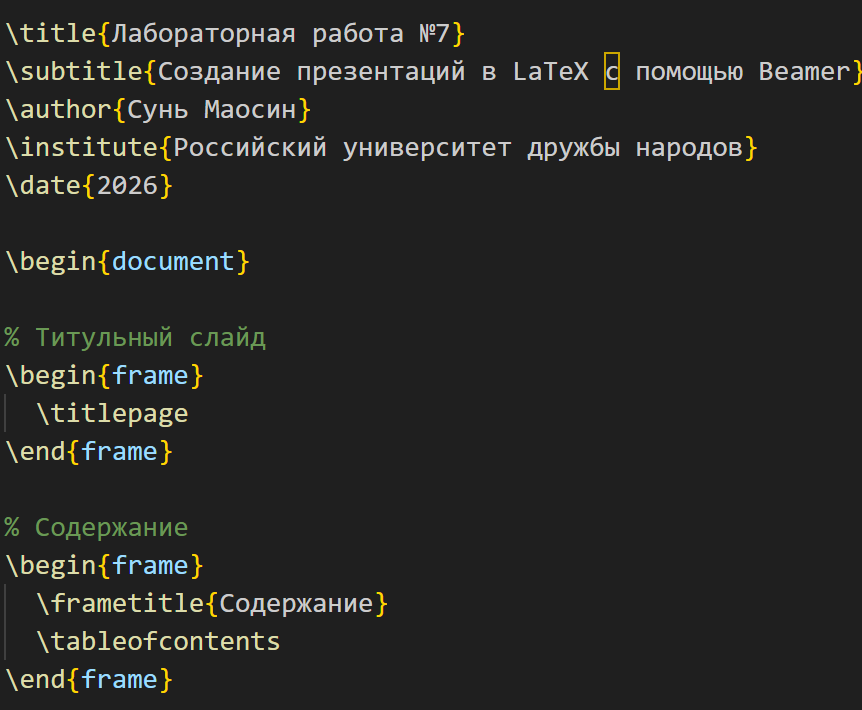

### Полученный результат

## Организация оглавления

Для обеспечения удобной навигации по докладу я создал отдельный слайд с командой tableofcontents. Я заметил, что Beamer автоматически собирает названия всех разделов section, что значительно упрощает логическое структурирование материала. В моей презентации 7 разделов: Введение, Структура презентации, Списки и анимация, Математика в презентациях, Таблицы и графики, Разные темы, Заключение.

### Код оглавления

### Полученный результат

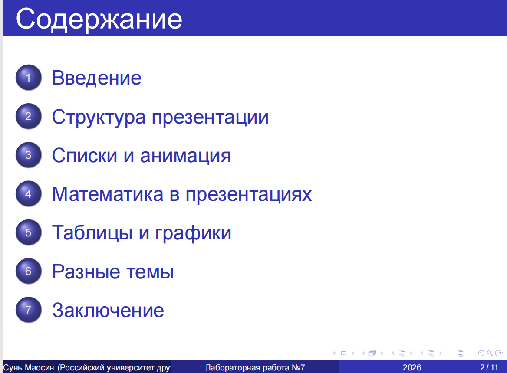

## Разработка контентных страниц с блоками

Я освоил создание стандартных кадров для передачи текстовой информации. В рамках упражнения я наполнил страницы маркированными списками itemize и использовал различные типы блоков.

### Код с использованием block и exampleblock

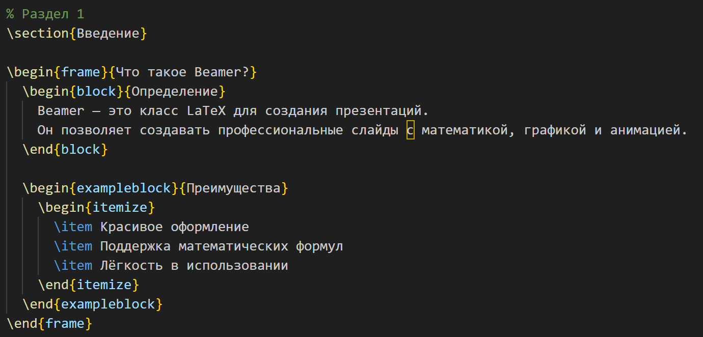

### Полученный результат

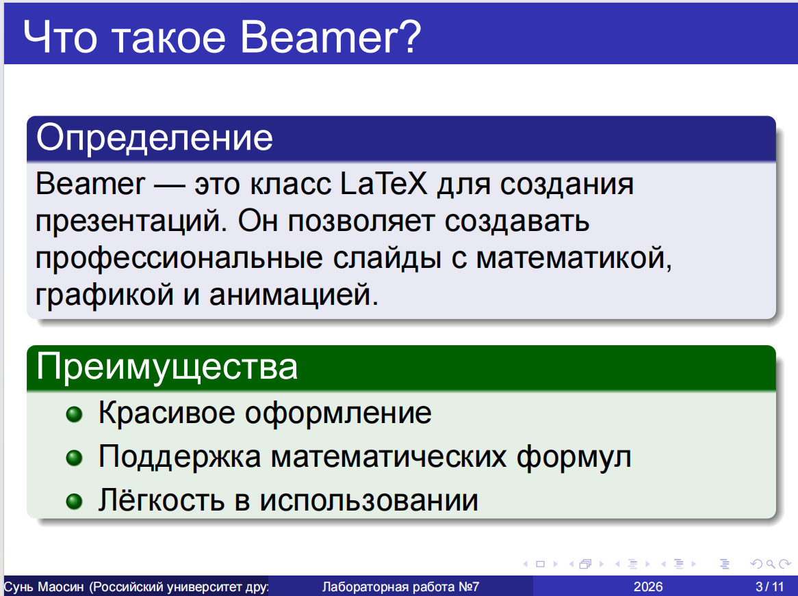

Для акцентирования внимания на ключевых моментах я интегрировал специальные окружения block (синий) и exampleblock (зелёный). Это позволило мне визуально отделить определения и преимущества от основного текста, улучшая восприятие презентации аудиторией.

## Многоколоночная верстка

Для эффективного использования пространства слайда я применил многоколоночную верстку с помощью окружения columns.

### Код двухколоночной верстки

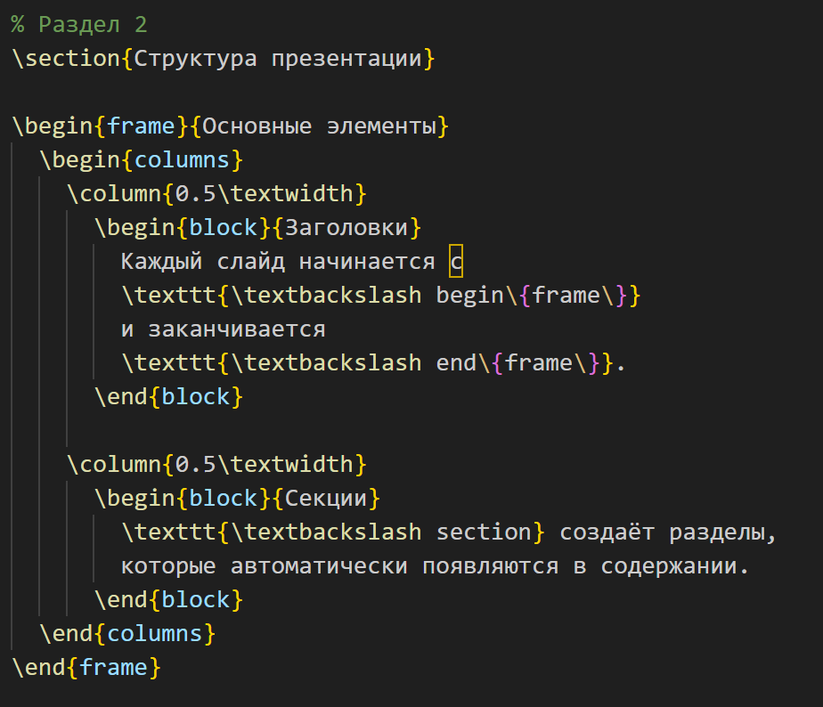

### Полученный результат

С помощью окружения columns и команды column я разместил информацию о заголовках и секциях в двух колонках рядом. Это экономит место и улучшает структуру слайда.

# Реализация пошагового вывода с командой pause

В ходе упражнения я освоил использование команды pause для управления динамикой презентации. Я применил эту команду внутри окружения itemize, что позволило мне выводить пункты списка последовательно.

### Код с использованием pause

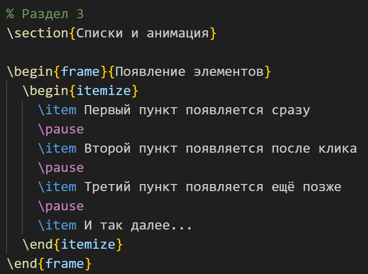

### Полученный результат

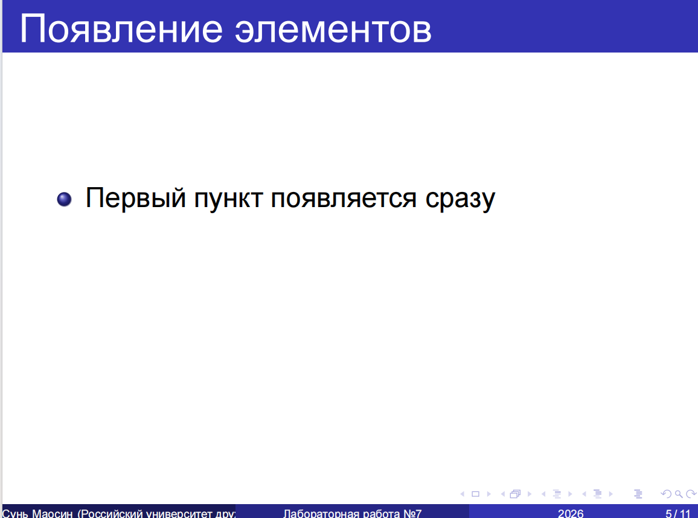
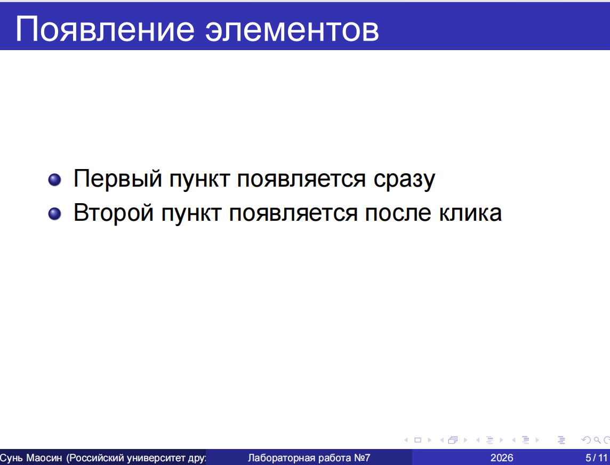
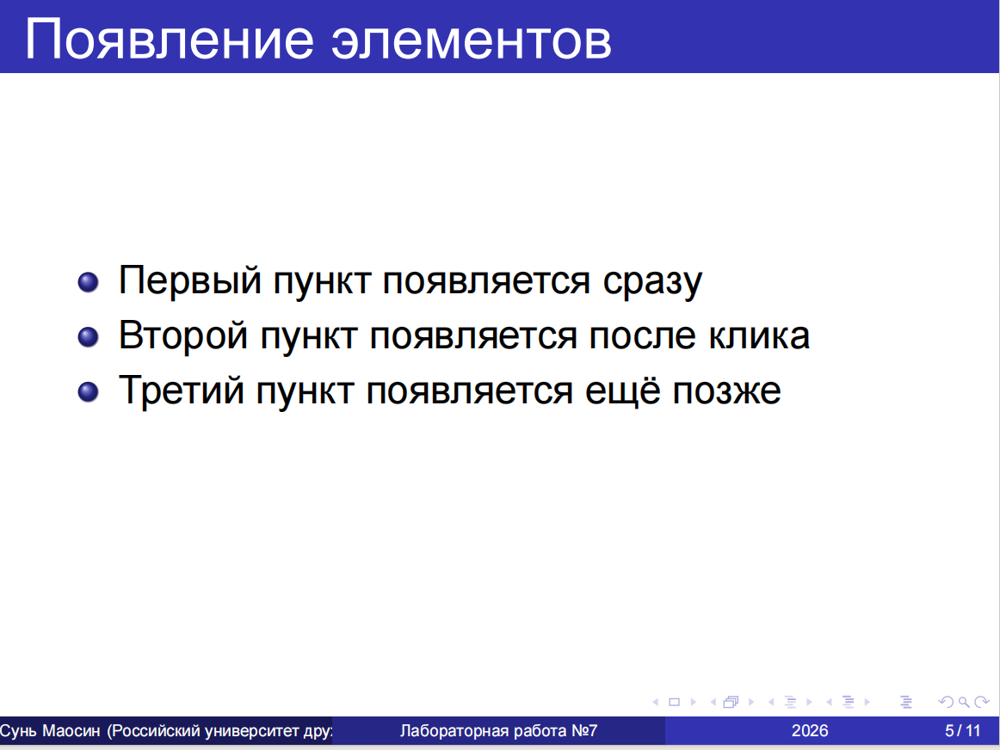

Команда pause разделяет один логический слайд на несколько физических страниц PDF. Это простейший способ управления вниманием аудитории во время выступления.

# Гибкое управление оверлеями с uncover

Я изучил команду uncover и опцию в угловых скобках для enumerate, которые позволяют более точно настраивать моменты появления объектов. В отличие от pause, этот метод заранее резервирует место под текст, что предотвращает нежелательные скачки элементов на слайде при их постепенном выводе.

### Код с использованием оверлеев

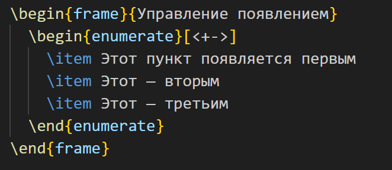

### Полученный результат

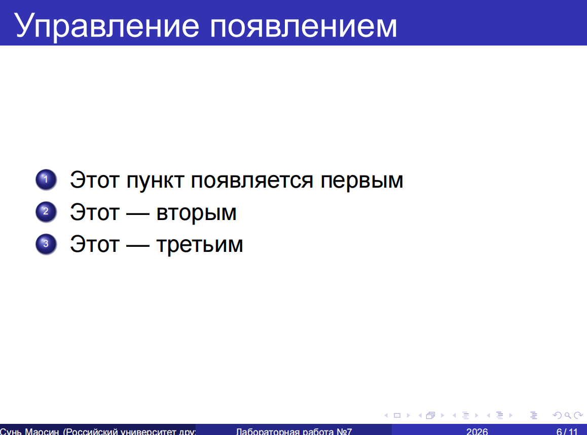

Эксперимент показал, что использование оверлеев делает презентацию более профессиональной за счет стабильного расположения заголовков и текста, независимо от текущего шага анимации.

# Математика в презентациях

Beamer обеспечивает идеальную интеграцию с математическим режимом LaTeX. Я добавил слайд с математическими формулами.

### Полученный результат

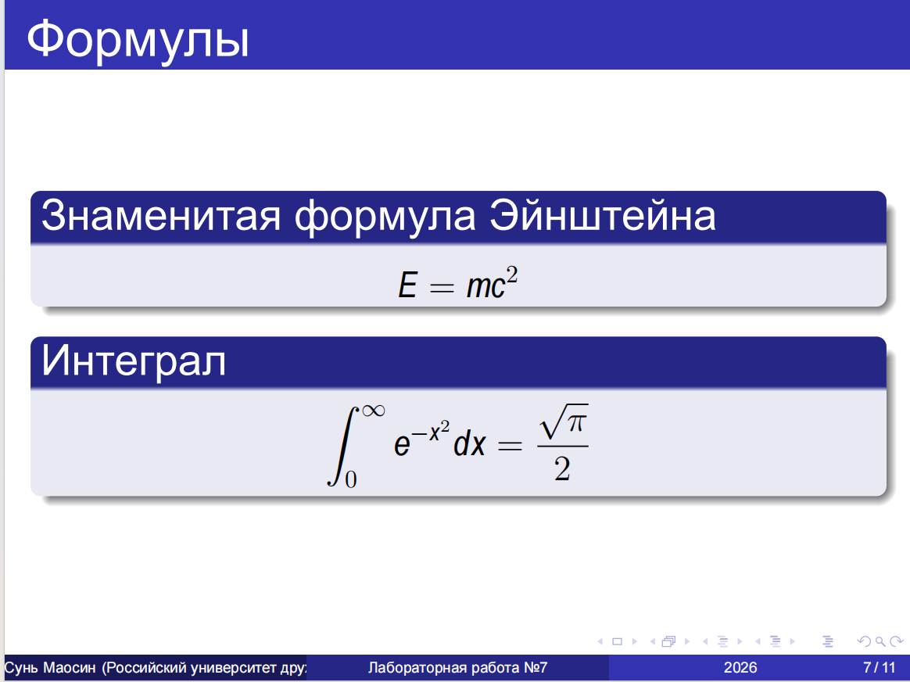

На слайде представлены знаменитая формула Эйнштейна E = mc² и интеграл от 0 до бесконечности e в степени минус x в квадрате dx равно корень из пи на два.

# Таблицы в презентациях

Я создал простую таблицу с данными о населении городов с помощью окружений table и tabular.

### Полученный результат

Таблица содержит три города (Москва, Пекин, Вашингтон) с их населением и странами.

# Разные темы Beamer

В Beamer доступно множество готовых тем оформления. В своей презентации я использовал тему Madrid, но также изучил другие доступные темы.

### Полученный результат

Доступные темы включают Madrid, Copenhagen, Warsaw, Berlin, Dresden, Frankfurt, Malmoe, Montpellier, Berkeley и многие другие.

# Заключение

## Итоговый слайд

В конце презентации я разместил заключительный блок с перечнем изученных возможностей и финальный слайд с благодарностью.

# Выводы

## Итоги работы

В ходе лабораторной работы были освоены:

- Освоение структуры презентации: я научился формировать логический каркас доклада, включая автоматическую генерацию титульного листа titlepage, оглавления tableofcontents и навигационных разделов section.

- Использование визуальных блоков: block для определений, exampleblock для примеров и преимуществ, alertblock для важных предупреждений.

- Многоколоночная верстка: эффективное использование пространства слайда с помощью окружения columns.

- Реализация динамических эффектов:
  - С помощью команды pause я реализовал простейший механизм поэтапного вывода информации.
  - С помощью команды uncover и спецификаций оверлеев я научился создавать сложные анимации с сохранением макета страницы, что исключает «прыгание» текста при переключении слайдов.

- Интеграция математических формул и таблиц: Beamer отлично работает со всеми возможностями LaTeX.

- Изменение оформления через темы: Madrid, Copenhagen, Warsaw и другие.

Использование LaTeX для презентаций признано эффективным благодаря идеальной интеграции с математическим текстом и профессиональному качеству верстки. Все файлы были успешно скомпилированы.