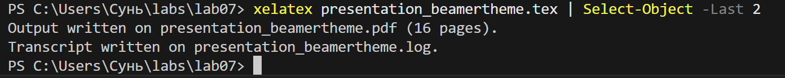
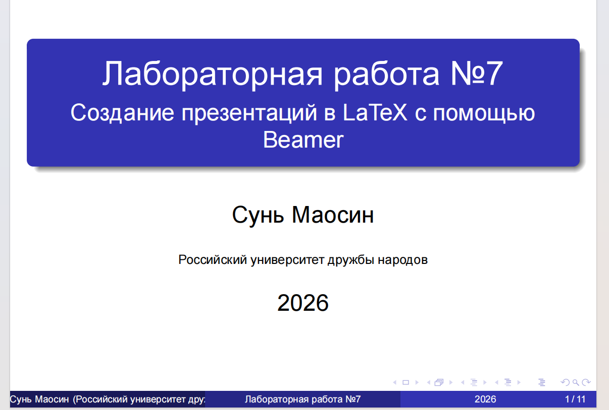
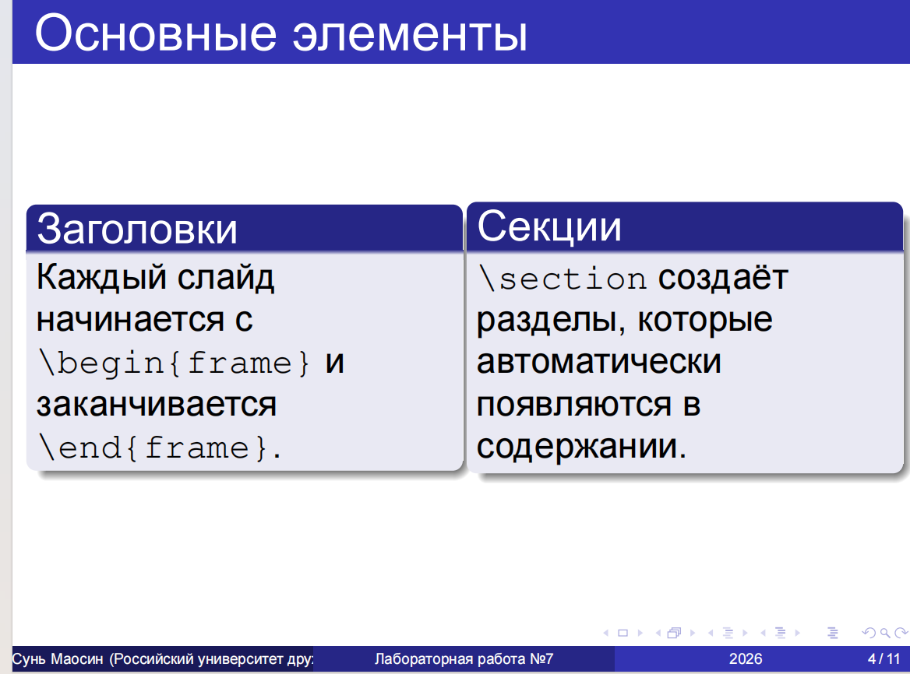
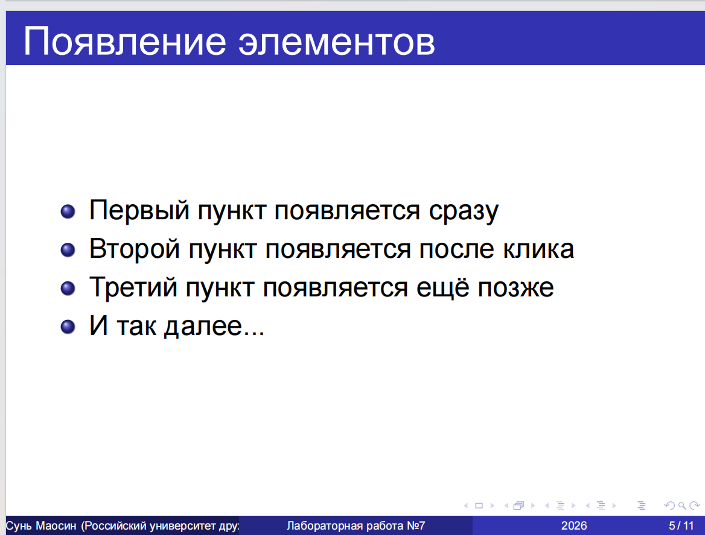
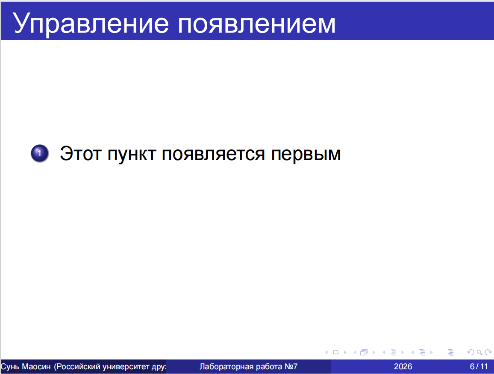
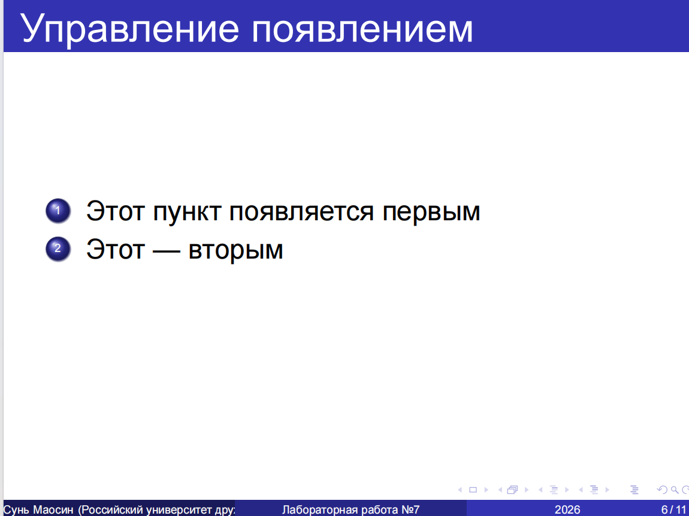
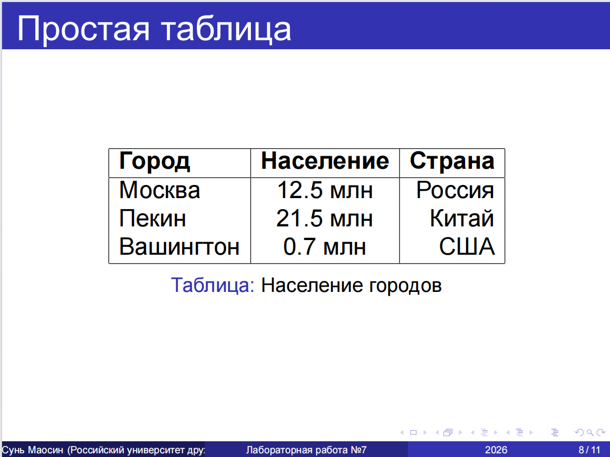
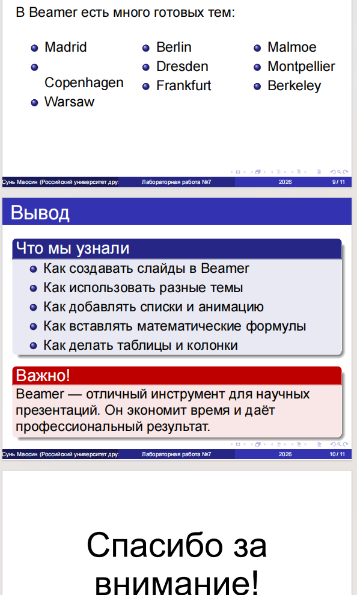

---
## Front matter
title: "Отчёт по лабораторной работе №7"
subtitle: "Computer Skills for Scientific Writing"
author: "Сунь Маосин"

## Generic otions
lang: ru-RU
toc-title: "Содержание"

## Pdf output format
toc: true
toc-depth: 2
lof: true
lot: true
fontsize: 12pt
linestretch: 1.5
papersize: a4
documentclass: scrreprt
## I18n polyglossia
polyglossia-lang:
  name: russian
  options:
    - spelling=modern
    - babelshorthands=true
polyglossia-otherlangs:
  name: english
## I18n babel
babel-lang: russian
babel-otherlangs: english
## Fonts
mainfont: Times New Roman
romanfont: Times New Roman
sansfont: Arial
monofont: Courier New
mathfont: Times New Roman
mainfontoptions: Ligatures=Common,Ligatures=TeX,Scale=0.94
romanfontoptions: Ligatures=Common,Ligatures=TeX,Scale=0.94
sansfontoptions: Ligatures=Common,Ligatures=TeX,Scale=MatchLowercase,Scale=0.94
monofontoptions: Scale=MatchLowercase,Scale=0.94,FakeStretch=0.9
mathfontoptions:
## Biblatex
biblatex: true
biblio-style: "gost-numeric"
biblatexoptions:
  - parentracker=true
  - backend=biber
  - hyperref=auto
  - language=auto
  - autolang=other*
  - citestyle=gost-numeric
## Pandoc-crossref LaTeX customization
figureTitle: "Рис."
tableTitle: "Таблица"
listingTitle: "Листинг"
lofTitle: "Список иллюстраций"
lotTitle: "Список таблиц"
lolTitle: "Листинги"
## Misc options
indent: true
header-includes:
  - \usepackage{indentfirst}
  - \usepackage{float}
  - \floatplacement{figure}{H}
---

# Цель работы

Изучить основные приёмы создания презентаций в LaTeX с использованием класса beamer. Освоить процесс компиляции различных примеров, демонстрирующих базовую структуру презентации, работу с блоками, пошаговое отображение элементов с помощью команды pause, управление порядком появления объектов с использованием команды uncover, а также изменение оформления через темы и цветовые схемы.

# Ход выполнения

## Компиляция исходного файла

На первом этапе был открыт исходный файл `presentation_beamertheme.tex` и выполнена его компиляция с помощью команды `pdflatex`. В процессе компиляции использовался класс beamer и тема Madrid.

## Структура презентации в Beamer

Был сформирован базовый каркас документа с использованием команды titlepage для титульного листа и tableofcontents для автоматического оглавления.

### Код титульной страницы и содержания

### Титульный лист

На титульном листе представлены название работы, подзаголовок, автор, институт и дата.

### Содержание презентации

Beamer автоматически синхронизирует структуру разделов section с навигационными панелями и оглавлением, обеспечивая строгую логику документа. В презентации представлены 7 разделов: Введение, Структура презентации, Списки и анимация, Математика, Таблицы и графики, Разные темы, Заключение.

## Разработка контентных страниц с блоками

Были созданы стандартные кадры frame, содержащие текст и различные типы блоков.

### Код с использованием block и exampleblock

### Результат: блоки в презентации

Для визуального акцентирования использованы блоки block (синий) и exampleblock (зелёный). Это позволило эффективно отделить определения и преимущества от основного текста, улучшая восприятие слайда.

## Многоколоночная верстка

Для размещения контента в несколько колонок использовано окружение columns.

### Код с двухколоночной версткой

### Результат: две колонки

С помощью окружения columns и команд column удалось разместить информацию о заголовках и секциях в двух колонках рядом, что экономит место и улучшает структуру слайда.

## Пошаговое появление элементов с помощью команды pause

В списки была вставлена команда pause для создания эффекта пошагового появления контента.

### Код с использованием команды pause

### Результат: поэтапное появление пунктов

Выявлено, что команда pause разделяет одну логическую страницу на несколько физических страниц PDF. Это простейший способ управления вниманием аудитории во время выступления.

## Управление оверлеями через опцию угловые скобки

Был реализован вывод текста с использованием опции в угловых скобках для enumerate.

### Код с использованием оверлеев

### Результат: поэтапное появление нумерованного списка

В отличие от команды pause, использование опции в угловых скобках заранее резервирует место под скрытый текст. Это исключает «прыгание» элементов и гарантирует стабильность макета при переключении этапов анимации.

## Математические формулы в презентациях

Beamer обеспечивает идеальную интеграцию с математическим режимом LaTeX.

### Результат: математические формулы

На слайде представлены знаменитая формула Эйнштейна E = mc² и интеграл от 0 до бесконечности e в степени минус x в квадрате dx равно корень из пи на два.

## Таблицы в презентациях

Была создана простая таблица с данными о населении городов.

### Результат: таблица

Таблица оформлена с использованием окружений table и tabular, содержит три города с их населением и странами.

## Разные темы и заключение

В презентации также продемонстрированы доступные темы Beamer и подведены итоги.

### Результат: список тем и заключение

На последних слайдах представлены:
- Список доступных тем Beamer (Madrid, Copenhagen, Warsaw, Berlin и др.)
- Заключительный блок с перечнем изученных возможностей
- Предупреждение о важности Beamer для научных презентаций
- Финальный слайд с благодарностью

# Вывод

В ходе выполнения лабораторной работы были освоены основные инструменты beamer:

- Создание структурированных презентаций с автоматической навигацией через команды section и tableofcontents
- Использование визуальных блоков (block, exampleblock, alertblock) для выделения ключевой информации
- Применение многоколоночной верстки с окружением columns
- Методы динамического вывода данных (команда pause и опция в угловых скобках), позволяющие контролировать темп подачи материала
- Интеграция математических формул и таблиц в презентации
- Изменение оформления через различные темы (Madrid, Copenhagen и др.)

Использование LaTeX для презентаций признано эффективным благодаря идеальной интеграции с математическим текстом и профессиональному качеству верстки. Все файлы были успешно скомпилированы, полученный PDF-документ полностью соответствует ожидаемым результатам.