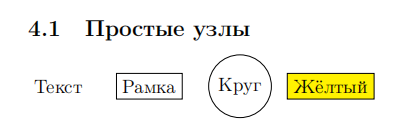
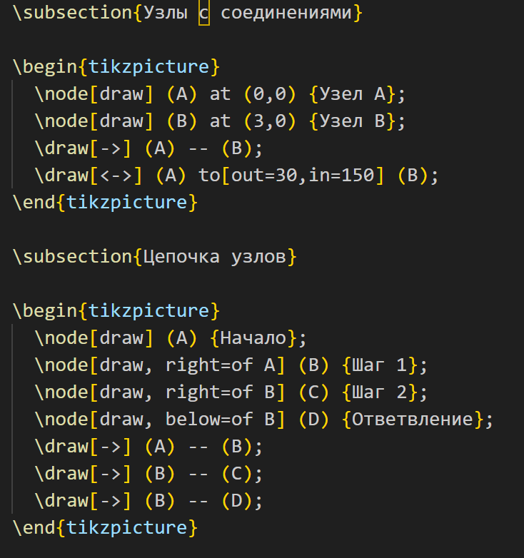
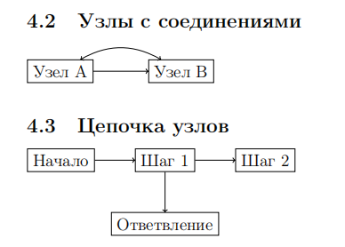
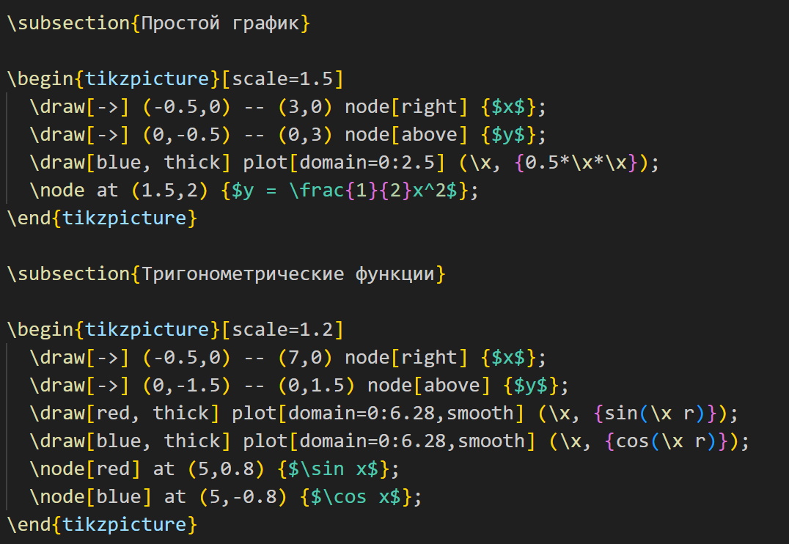
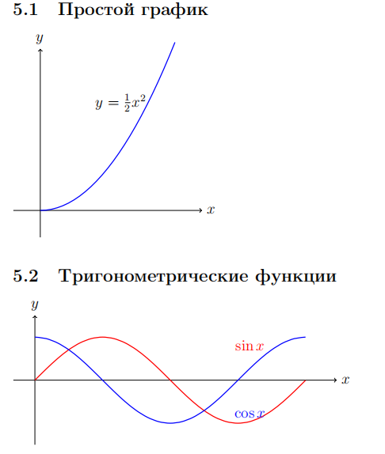
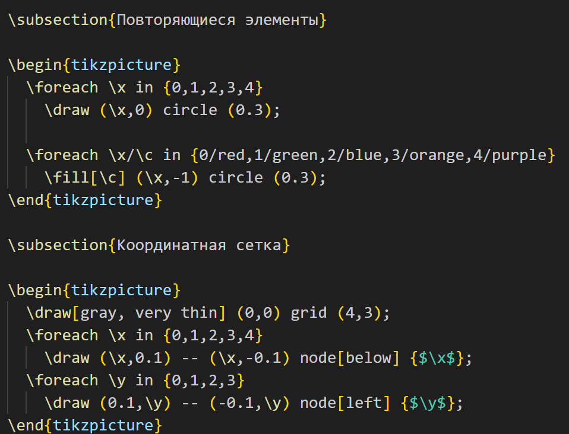
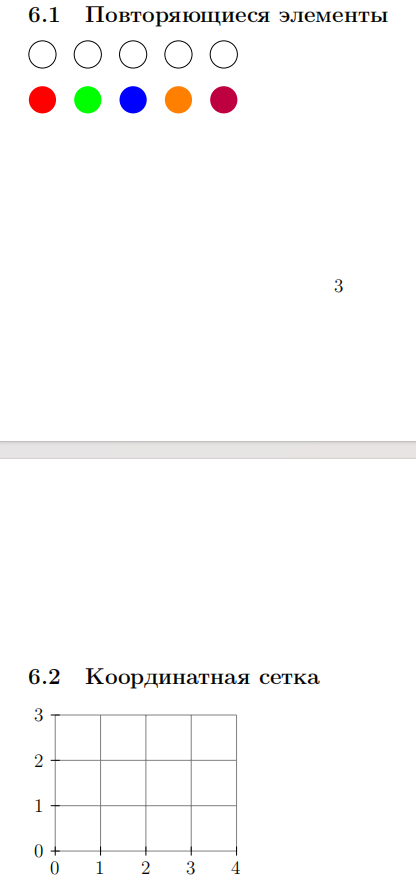

---
## Front matter
lang: ru-RU
title: Лабораторная работа №8
subtitle: Создание графических объектов в LaTeX с помощью TikZ
author:
  - Сунь Маосин
institute:
  - Российский университет дружбы народов, Москва, Россия
date: 2026

## Formatting pdf
toc: false
slide_level: 2
aspectratio: 169
section-titles: true
theme: metropolis
header-includes:
 - \metroset{progressbar=frametitle,sectionpage=progressbar,numbering=fraction}
 - \usepackage{fontspec}
 - \setmainfont{Times New Roman}
 - \setsansfont{Arial}
 - \setmonofont{Courier New}
---

# Цель работы

## Основная цель

Изучение возможностей пакета TikZ для создания графических объектов в LaTeX, включая построение графов, графиков функций и фрактальных структур, а также освоение принципов описания изображений в виде кода.

# Ход выполнения

## Компиляция исходного файла

### Компиляция tikz_drawing.tex

Я открыл файл `tikz_drawing.tex` в текстовом редакторе и выполнил его компиляцию с помощью команды `pdflatex`. В процессе компиляции использовался пакет TikZ для создания всех графических элементов.

---

## Основные геометрические фигуры

### Код геометрических фигур

---

### Результат: геометрические фигуры

В ходе упражнения были созданы различные типы линий (прямые, со стрелками), прямоугольники (с заливкой и без), окружности и эллипсы.

---

## Работа с цветом и стилями

### Код цветных линий

---

### Результат: цветные линии

Протестированы различные цвета (красный, синий, зелёный, оранжевый, фиолетовый) и стили линий (сплошная, пунктирная, штрихпунктирная).

---

## Простые узлы

### Код простых узлов

---

### Результат: простые узлы

Созданы узлы различных типов: без рамки, с рамкой, круглые, прямоугольные с заливкой.

---

## Соединение узлов

### Код соединения узлов

---

### Результат: соединение узлов

Реализовано соединение узлов прямыми и изогнутыми линиями, а также построена цепочка узлов с ответвлением.

---

## Графики функций

### Код графиков функций

---

### Результат: графики функций

С помощью параметра `samples` я добился высокой плавности кривых. Построены графики квадратичной функции, а также тригонометрических функций синуса и косинуса.

---

## Использование циклов

### Код с циклами

---

### Результат: использование циклов

С помощью циклов `foreach` созданы повторяющиеся элементы (окружности) и координатная сетка с подписями.

---

## Сложные примеры

В работе также были созданы более сложные структуры: простой граф с тремя узлами и схема алгоритма с использованием различных стилей узлов.

# Итоги работы

## Вывод

В ходе выполнения лабораторной работы я освоил:

- основы работы с пакетом TikZ;
- создание геометрических фигур (линии, прямоугольники, окружности, эллипсы);
- работу с цветами и стилями линий;
- создание и соединение узлов;
- визуализацию математических функций с настройкой точности;
- использование циклов для повторяющихся элементов;
- создание сложных схем и графов.

Пакет TikZ позволяет эффективно создавать качественные графические объекты непосредственно в LaTeX-документах. Все файлы были успешно скомпилированы, полученный PDF-документ полностью соответствует ожидаемым результатам.