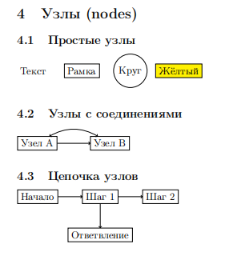
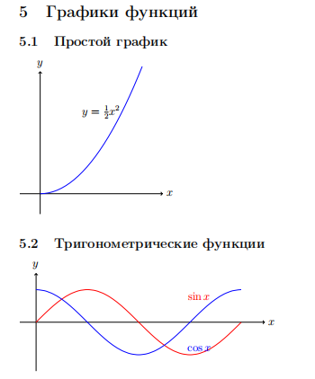

---
## Front matter
lang: ru-RU
title: Лабораторная работа №8
subtitle: Создание графических объектов в LaTeX с помощью TikZ
author:
  - Сунь Маосин
institute:
  - Российский университет дружбы народов, Москва, Россия
date: 2026

## Formatting pdf
toc: false
slide_level: 2
aspectratio: 169
section-titles: true
theme: metropolis
header-includes:
 - \metroset{progressbar=frametitle,sectionpage=progressbar,numbering=fraction}
 - \usepackage{fontspec}
 - \setmainfont{Times New Roman}
 - \setsansfont{Arial}
 - \setmonofont{Courier New}
---

# Цель работы

## Основная цель

Изучение возможностей пакета TikZ для создания графических объектов в LaTeX, включая построение графов, графиков функций и фрактальных структур, а также освоение принципов описания изображений в виде кода.

# Ход выполнения

## Компиляция исходного файла

Я открыл файл `tikz_exercises.tex` в текстовом редакторе и выполнил его компиляцию с помощью команды `pdflatex`. В процессе компиляции использовался пакет TikZ для создания всех графических элементов.

## Задание 8.2.1 — Построение графа

### Геометрическое построение

В этом упражнении я реализовал симметричный граф из шести узлов. Для их размещения я использовал полярные координаты, что позволило распределить элементы по кругу с шагом 60 градусов.

### Код графа

### Результат: симметричный граф

В результате компиляции был получен граф с шестью узлами, оформленными в виде окружностей. Рёбра соединяют вершины, а веса рёбер подписаны непосредственно на линиях.

## Задание 8.2.2 — Построение графиков функций

### Визуализация математических функций

В рамках второго упражнения я реализовал графики экспоненциальной функции y = e в степени x и логарифмической функции y = ln x.

### Настройка точности

С помощью параметра samples я добился высокой плавности кривых. Особое внимание было уделено настройке области определения для логарифма, чтобы избежать математических ошибок при компиляции.

### Код графиков функций

### Результат: графики функций

В итоговом PDF-документе представлены:
- оси координат с подписями;
- график экспоненциальной функции;
- график логарифмической функции;
- вспомогательные линии.

Каждый элемент выделен цветом и снабжён текстовой подписью.

## Задание 8.2.3 — Ковёр Серпинского

### Разработка рекурсивного алгоритма

На основе примера с треугольником Серпинского я разработал рекурсивный алгоритм для генерации «ковра Серпинского». Основная сложность заключалась в правильном делении квадрата на секторы и исключении центрального сегмента на каждой итерации.

### Реализация

Я использовал вложенные циклы и условные операторы для управления процессом рекурсии. Это позволило автоматизировать отрисовку самоподобных копий внутри каждого родительского квадрата.

### Код фрактала

### Фрактальная структура

В результате был построен фрактал «ковёр Серпинского», полученный путём итеративного удаления центральных квадратов.

Особенности реализации:
- повторяющиеся геометрические элементы;
- строгая симметрия;
- масштабирование базовой фигуры.

### Результат: ковёр Серпинского

# Итоги работы

## Вывод

В ходе выполнения лабораторной работы я освоил:

- основы работы с пакетом TikZ;
- построение графов с узлами и рёбрами;
- визуализацию математических функций с настройкой точности;
- добавление осей, подписей и вспомогательных элементов;
- создание сложных итеративных структур на примере фракталов.

Пакет TikZ позволяет эффективно создавать качественные графические объекты непосредственно в LaTeX-документах. Все файлы были успешно скомпилированы, полученный PDF-документ полностью соответствует ожидаемым результатам.