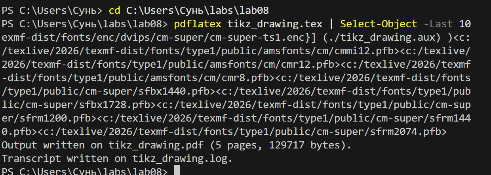
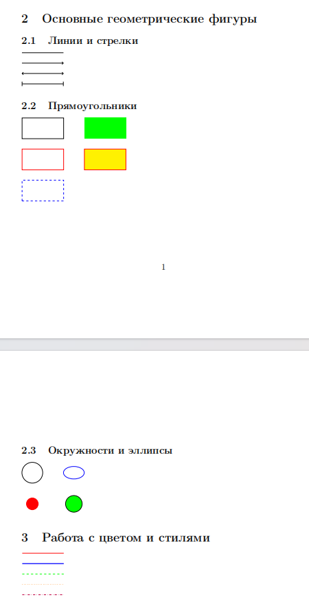
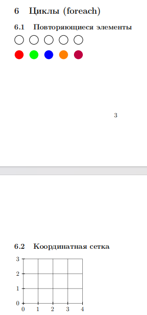
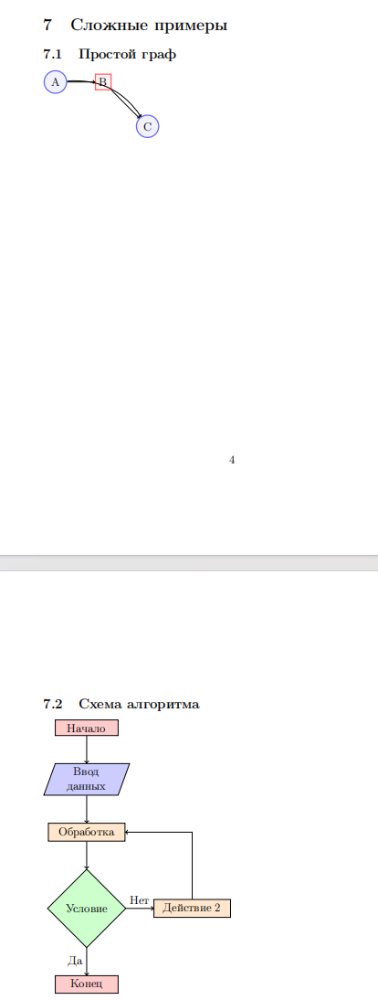

---
## Front matter
title: "Отчёт по лабораторной работе №8"
subtitle: "Computer Skills for Scientific Writing"
author: "Сунь Маосин"

## Generic otions
lang: ru-RU
toc-title: "Содержание"

## Pdf output format
toc: true
toc-depth: 2
lof: true
lot: true
fontsize: 12pt
linestretch: 1.5
papersize: a4
documentclass: scrreprt
## I18n polyglossia
polyglossia-lang:
  name: russian
  options:
    - spelling=modern
    - babelshorthands=true
polyglossia-otherlangs:
  name: english
## I18n babel
babel-lang: russian
babel-otherlangs: english
## Fonts
mainfont: Times New Roman
romanfont: Times New Roman
sansfont: Arial
monofont: Courier New
mathfont: Times New Roman
mainfontoptions: Ligatures=Common,Ligatures=TeX,Scale=0.94
romanfontoptions: Ligatures=Common,Ligatures=TeX,Scale=0.94
sansfontoptions: Ligatures=Common,Ligatures=TeX,Scale=MatchLowercase,Scale=0.94
monofontoptions: Scale=MatchLowercase,Scale=0.94,FakeStretch=0.9
mathfontoptions:
## Biblatex
biblatex: true
biblio-style: "gost-numeric"
biblatexoptions:
  - parentracker=true
  - backend=biber
  - hyperref=auto
  - language=auto
  - autolang=other*
  - citestyle=gost-numeric
## Pandoc-crossref LaTeX customization
figureTitle: "Рис."
tableTitle: "Таблица"
listingTitle: "Листинг"
lofTitle: "Список иллюстраций"
lotTitle: "Список таблиц"
lolTitle: "Листинги"
## Misc options
indent: true
header-includes:
  - \usepackage{indentfirst}
  - \usepackage{float}
  - \floatplacement{figure}{H}
---

# Цель работы

Изучение возможностей пакета TikZ для создания векторной графики в LaTeX.

# Ход выполнения

## Компиляция исходного файла

На первом этапе был открыт исходный файл `tikz_drawing.tex` и выполнена его компиляция с помощью команды `pdflatex`.

## Основные геометрические фигуры и работа с цветом

В ходе упражнения были созданы различные типы линий (прямые, со стрелками), прямоугольники (с заливкой и без), окружности, а также протестированы различные цвета и стили линий.

## Работа с узлами

Созданы узлы различных типов: без рамки, с рамкой, круглые, прямоугольные с заливкой. Реализовано соединение узлов прямыми и изогнутыми линиями, а также построена цепочка узлов с ответвлением.

## Графики функций

Построены графики квадратичной функции, а также тригонометрических функций синуса и косинуса.

## Использование циклов

С помощью циклов `foreach` созданы повторяющиеся элементы и координатная сетка с подписями.

## Сложные примеры

Созданы более сложные структуры: простой граф с тремя узлами и схема алгоритма с использованием различных стилей узлов.

# Вывод

В ходе выполнения лабораторной работы были изучены основные возможности пакета TikZ: создание геометрических фигур, работа с цветами и стилями, создание и соединение узлов, построение графиков функций, использование циклов, создание сложных схем и графов. Все файлы успешно скомпилированы.